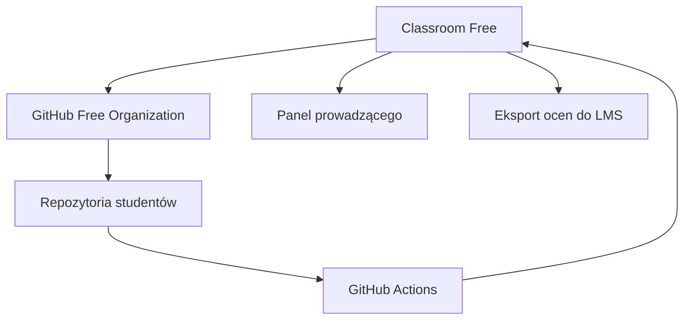
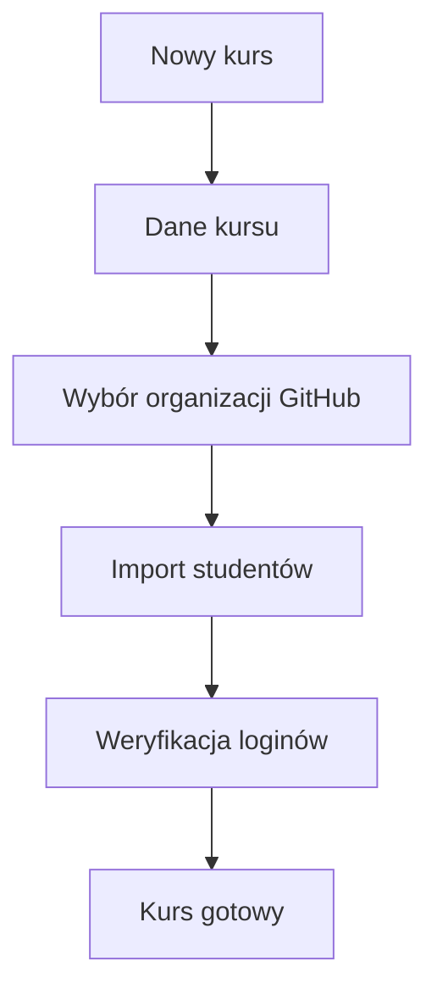
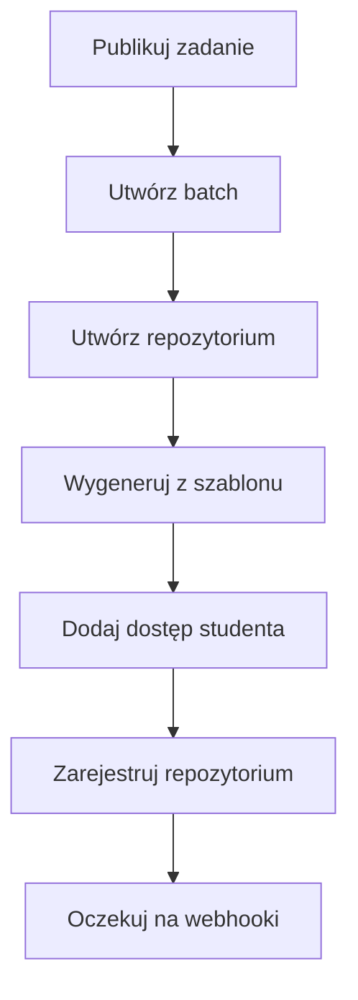
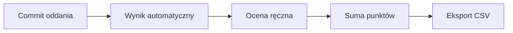
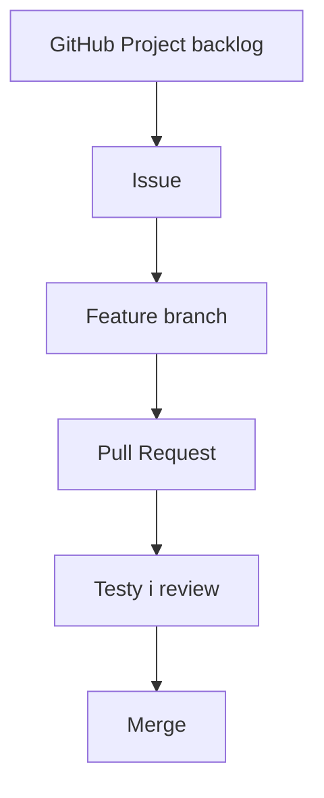
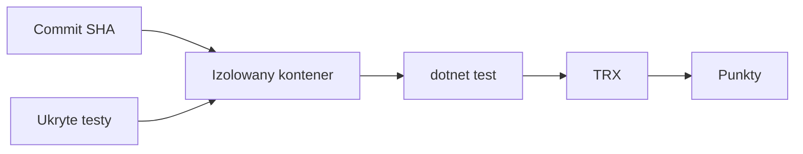
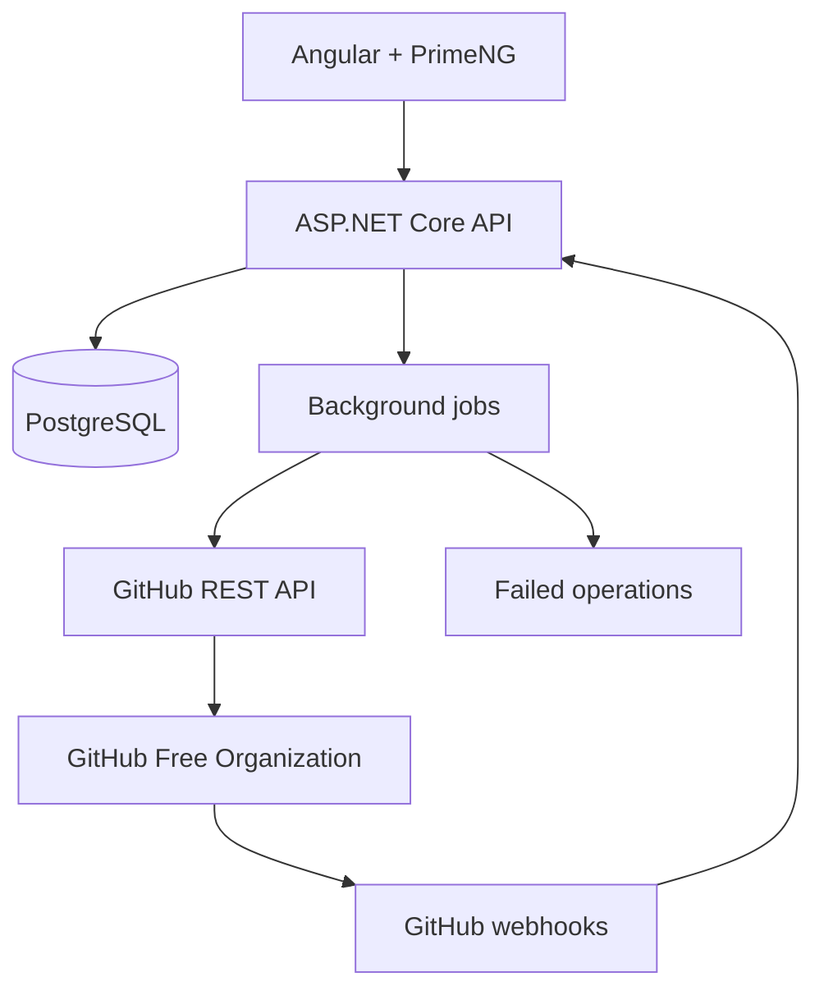
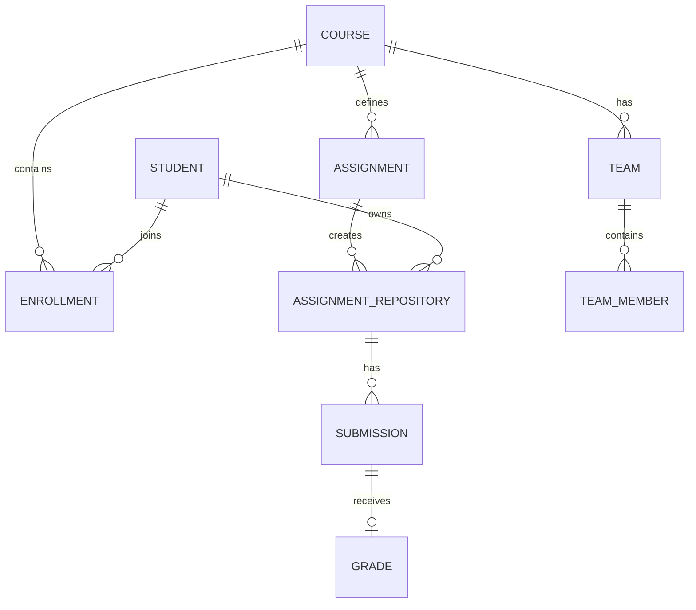
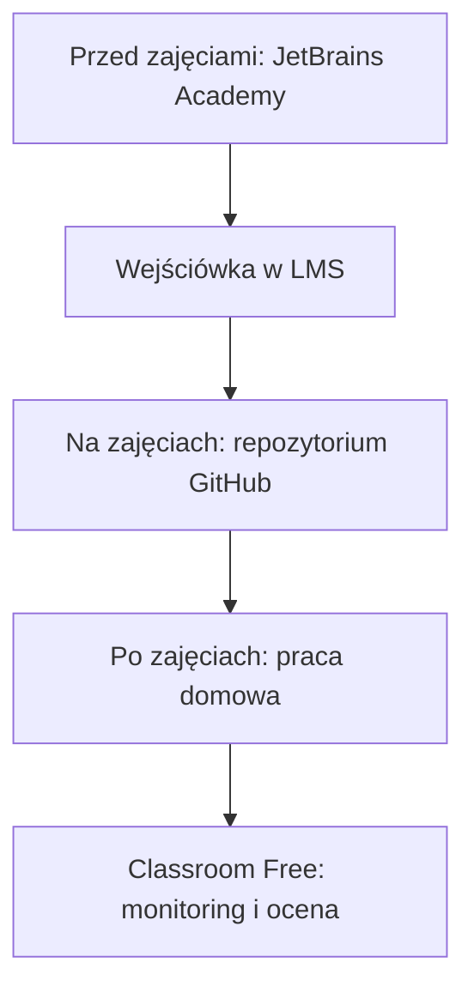

# 🎓 Classroom Free — opis i specyfikacja własnego systemu do obsługi zadań programistycznych

> [!TIP]
> **Cel dokumentu:** opisać własną aplikację zastępującą najważniejsze funkcje GitHub Classroom, działającą na bezpłatnej organizacji GitHub i dopasowaną do prowadzenia akademickich zajęć programistycznych, prac domowych oraz projektów zespołowych.

---

## 📌 Metryka dokumentu

| Pole | Wartość |
|---|---|
| Nazwa robocza | **Classroom Free** |
| Rodzaj dokumentu | Opis produktu + wymagania + projekt techniczny |
| Główny użytkownik | Prowadzący akademicki |
| Główny przypadek użycia | Dystrybucja i ocenianie zadań programistycznych przez GitHub |
| Platforma kodu | GitHub Free Organization |
| Backend | ASP.NET Core / .NET 10 |
| Frontend | Angular + PrimeNG |
| Baza danych | PostgreSQL lub MariaDB |
| Integracja | GitHub App + GitHub REST API + webhooki |
| Uruchomienie | Docker Compose / VPS / serwer uczelniany |
| Status | Koncepcja do realizacji |

---

# 1. Streszczenie projektu

**Classroom Free** to lekka aplikacja dla prowadzącego, która automatyzuje pracę z zadaniami programistycznymi w darmowej organizacji GitHub.

System ma zastąpić najważniejsze elementy GitHub Classroom:

- tworzenie kursów i grup,
- import studentów,
- tworzenie zadań z repozytoriów szablonowych,
- masowe tworzenie prywatnych repozytoriów,
- przyznawanie studentom dostępu,
- monitorowanie commitów,
- odczytywanie wyników GitHub Actions,
- obsługę terminów,
- zapis wersji oddanej do oceny,
- punktację i eksport wyników.

Aplikacja nie ma być pełnym LMS-em ani kopią wszystkich funkcji GitHub Classroom. Jej zadaniem jest zapewnienie prowadzącemu wygodnej warstwy zarządzającej nad standardowymi repozytoriami GitHub.



---

# 2. Uzasadnienie

## 2.1. Problem

GitHub Classroom był używany do:

- rozdawania zadań,
- automatycznego tworzenia repozytoriów,
- pracy z organizacjami GitHub,
- obserwowania wyników automatycznych testów,
- organizowania projektów indywidualnych i zespołowych.

Po wycofaniu GitHub Classroom wskazany następca open source — Classroom 50 — wymaga organizacji na planie GitHub Team albo Enterprise. Dla zweryfikowanego nauczyciela GitHub Team może być bezpłatny, ale wniosek GitHub Education może zostać odrzucony, nawet bez jasnego uzasadnienia.

W konsekwencji prowadzący korzystający wyłącznie z GitHub Free potrzebuje własnej warstwy automatyzacji.

## 2.2. Dlaczego nie zwykłe ręczne repozytoria?

Przy większej grupie ręczne operacje stają się kosztowne:

- tworzenie kilkudziesięciu repozytoriów,
- zapraszanie studentów,
- kontrolowanie wyników workflow,
- sprawdzanie, kto rozpoczął pracę,
- zapisywanie wersji istniejącej w terminie,
- eksportowanie wyników.

System powinien zamienić te operacje w kilka działań wykonywanych z panelu.

## 2.3. Główna wartość

> **Prowadzący definiuje zadanie raz, a aplikacja tworzy i monitoruje wszystkie repozytoria studentów.**

---

# 3. Cele i kryteria sukcesu

## 3.1. Cele produktu

1. Działać na darmowej organizacji GitHub.
2. Nie wymagać zaakceptowanego GitHub Education.
3. Automatyzować tworzenie repozytoriów indywidualnych i zespołowych.
4. Pokazywać postępy całej grupy w jednym panelu.
5. Zapisywać jednoznaczną wersję pracy w terminie.
6. Odczytywać wyniki GitHub Actions.
7. Umożliwiać ręczne uzupełnienie oceny jakościowej.
8. Eksportować wyniki do CSV.
9. Zachować GitHub jako właściwe miejsce pracy z kodem, PR-ami i review.
10. Ograniczyć koszty utrzymania do małego VPS-a lub serwera uczelnianego.

## 3.2. Kryteria sukcesu MVP

MVP jest użyteczne, jeśli prowadzący może:

- [ ] podłączyć jedną organizację GitHub,
- [ ] utworzyć kurs,
- [ ] zaimportować studentów z CSV,
- [ ] wskazać repozytorium szablonowe,
- [ ] utworzyć indywidualne repozytoria całej grupy,
- [ ] zobaczyć status utworzenia i zaproszeń,
- [ ] obserwować ostatnie commity,
- [ ] obserwować wynik GitHub Actions,
- [ ] zapisać SHA pracy w chwili terminu,
- [ ] wpisać punkty ręczne,
- [ ] wyeksportować oceny do CSV.

## 3.3. Mierzalne rezultaty

| Miernik | Cel MVP |
|---|---:|
| Czas przygotowania 40 repozytoriów | poniżej 10 minut pracy użytkownika |
| Ręczne operacje GitHub na jednego studenta | 0 w typowym przepływie |
| Identyfikowalność wersji oddanej | 100% przez commit SHA |
| Widoczność statusu grupy | jeden ekran |
| Eksport punktów | jeden plik CSV |
| Koszt GitHub | 0 zł do limitów planu Free |

---

# 4. Zakres systemu

## 4.1. Zakres MVP

### Kursy

- tworzenie i edycja kursu,
- przypisanie organizacji GitHub,
- rok akademicki i semestr,
- status: przygotowanie, aktywny, zakończony, archiwalny.

### Studenci

- import z CSV,
- identyfikator uczelniany,
- imię i nazwisko,
- e-mail,
- login GitHub,
- status weryfikacji,
- status zaproszenia.

### Zadania

- zadania indywidualne,
- zadania zespołowe,
- repozytorium szablonowe,
- nazwa i opis,
- termin,
- maksymalna liczba punktów,
- wzorzec nazwy repozytorium,
- publikacja dla całej grupy.

### Repozytoria

- masowe tworzenie,
- tworzenie z szablonu,
- repozytoria prywatne,
- dodawanie studentów,
- status każdej operacji,
- ponawianie nieudanych operacji.

### Postępy

- ostatni push,
- ostatni commit SHA,
- liczba commitów,
- otwarty Pull Request,
- wynik ostatniego workflow,
- link do repozytorium i workflow.

### Terminy i oddanie

- automatyczne zapisanie SHA w terminie,
- opcjonalne wcześniejsze oddanie,
- oznaczenie spóźnienia,
- zapisanie historii ponownych oddań.

### Oceny

- punkty automatyczne,
- punkty ręczne,
- komentarz prowadzącego,
- status oceny,
- eksport CSV.

## 4.2. Zakres późniejszy

- wielu prowadzących,
- asystenci i recenzenci,
- wiele organizacji GitHub,
- integracja z Shogunem lub LMS,
- powiadomienia e-mail,
- rubryki ocen,
- import wyników testów z TRX/JUnit XML,
- dashboard statystyk,
- plagiat i podobieństwo kodu,
- ukryte testy uruchamiane przez własny grader,
- retake i poprawy,
- tokeny spóźnień,
- archiwizacja semestru,
- API dla innych systemów uczelnianych.

## 4.3. Poza zakresem MVP

- edytor kodu w przeglądarce,
- zamiennik Ridera lub VS Code,
- pełny LMS,
- przechowywanie materiałów wykładowych,
- wideokonferencje,
- dziennik obecności,
- płatności,
- publiczny marketplace kursów,
- uruchamianie niezaufanego kodu na serwerze aplikacji,
- własny system kontroli wersji.

---

# 5. Użytkownicy i role

## 5.1. Prowadzący

Główny użytkownik MVP.

Może:

- podłączyć organizację,
- zarządzać kursem,
- importować studentów,
- tworzyć zadania,
- publikować repozytoria,
- obserwować postępy,
- zapisywać oddania,
- oceniać,
- eksportować wyniki.

## 5.2. Student

W MVP student nie musi logować się do Classroom Free.

Pracuje bezpośrednio na GitHubie:

- przyjmuje zaproszenie,
- klonuje repozytorium,
- wykonuje zadanie,
- wysyła commity,
- obserwuje GitHub Actions,
- opcjonalnie otwiera Pull Request.

## 5.3. Asystent — późniejszy etap

Może:

- obserwować przydzielone grupy,
- wykonywać code review,
- wpisywać punkty ręczne,
- nie może zmieniać konfiguracji organizacji ani usuwać repozytoriów.

## 5.4. Administrator — późniejszy etap

Może:

- zarządzać instancją,
- dodawać prowadzących,
- konfigurować organizacje,
- przeglądać audyt,
- zarządzać retencją danych.

---

# 6. Główne procesy biznesowe

## 6.1. Utworzenie kursu



### Dane kursu

- nazwa,
- kod przedmiotu,
- semestr,
- rok akademicki,
- organizacja GitHub,
- domyślna strefa czasowa,
- domyślny wzorzec nazwy repozytorium.

Przykład:

```text
Nazwa: Programowanie obiektowe w C#
Kod: POCS
Rok: 2026/2027
Semestr: zimowy
Organizacja: pjwstk-csharp-2026
Strefa: Europe/Warsaw
```

## 6.2. Import studentów

Przykładowy CSV:

```csv
studentId,name,email,githubUsername
s12345,Jan Kowalski,j.kowalski@pjwstk.edu.pl,jankowalski
s12346,Anna Nowak,a.nowak@pjwstk.edu.pl,annanowak
```

Po imporcie system:

1. waliduje format,
2. wykrywa duplikaty,
3. sprawdza istnienie loginu GitHub,
4. zapisuje wynik,
5. pokazuje rekordy wymagające poprawy.

| Student | Login | Status |
|---|---|---|
| Jan Kowalski | `jankowalski` | ✅ zweryfikowany |
| Anna Nowak | `annanowak` | 🟡 oczekuje na zaproszenie |
| Piotr Wiśniewski | brak | 🔴 wymaga uzupełnienia |

## 6.3. Utworzenie zadania

Prowadzący określa:

- nazwę,
- identyfikator,
- opis,
- typ: indywidualne lub zespołowe,
- szablon,
- termin,
- maksymalną liczbę punktów,
- wzorzec repozytorium,
- tryb automatycznego sprawdzania.

Przykład:

```text
Nazwa: Kalkulator zamówień
Slug: hw-01
Typ: indywidualne
Termin: 2026-10-18 23:59 Europe/Warsaw
Punkty: 10
Szablon: pjwstk-csharp-2026/homework-01-template
Repozytorium: hw-01-{githubUsername}
```

## 6.4. Publikacja zadania



Operacje są wykonywane w tle i niezależnie dla każdego studenta.

Błąd jednego repozytorium nie może zatrzymać pozostałych.

Panel postępu:

```text
Utworzono repozytoria: 37/42
Wysłano zaproszenia: 35/42
Oczekujące: 5
Błędy: 2
```

Każdy błąd powinien zawierać:

- nazwę studenta,
- wykonywany krok,
- kod GitHub API,
- bezpieczny komunikat,
- informację, czy operację można ponowić.

## 6.5. Praca studenta

Student:

1. przyjmuje zaproszenie,
2. klonuje repozytorium,
3. pracuje w Riderze lub innym IDE,
4. wykonuje commity,
5. wysyła kod,
6. obserwuje GitHub Actions,
7. opcjonalnie otwiera Pull Request.

Classroom Free odbiera webhooki i aktualizuje dashboard.

## 6.6. Obsługa terminu

Rekomendowany model: **snapshot commit SHA**, a nie blokowanie repozytorium.

W chwili terminu system:

1. pobiera domyślną gałąź,
2. odczytuje aktualny commit SHA,
3. zapisuje go jako wersję do oceny,
4. zapisuje czas,
5. opcjonalnie tworzy tag,
6. oznacza brak oddania, jeśli nie ma commitów studenta.

```text
deadlineCommitSha
submittedAt
submissionSource
wasLate
```

Opcjonalny tag:

```text
submission-2026-10-18
```

### Dlaczego snapshot zamiast blokady?

- student może dalej poprawiać kod,
- prowadzący ma jednoznaczną wersję do oceny,
- łatwo przeprowadzić poprawę,
- nie trzeba zmieniać uprawnień,
- ponowna ocena jest reprodukowalna,
- późniejsze commity pozostają widoczne.

## 6.7. Ocena



Przykładowa rubryka:

| Kryterium | Punkty |
|---|---:|
| Kompilacja | 1 |
| Testy podstawowe | 3 |
| Przypadki brzegowe | 2 |
| Architektura | 2 |
| Jakość kodu | 1 |
| Historia Git i terminowość | 1 |
| Razem | 10 |

W MVP punkty ręczne mogą być prostą liczbą i komentarzem. Rubryki szczegółowe mogą zostać dodane później.

---

# 7. Zadania indywidualne i projekty zespołowe

## 7.1. Zadania indywidualne

Dla każdego studenta powstaje osobne repozytorium:

```text
hw-01-jankowalski
hw-01-annanowak
hw-01-pwisniewski
```

Zalecana zawartość szablonu:

```text
src/
tests/
README.md
.github/workflows/verify.yml
```

## 7.2. Projekty zespołowe

Dla każdego zespołu powstaje repozytorium:

```text
project-team-01
project-team-02
project-team-03
```

System przechowuje:

- skład zespołu,
- repozytorium,
- role członków,
- etapy projektu,
- milestone'y,
- ocenę wspólną,
- opcjonalne korekty indywidualne.

## 7.3. Zalecany proces projektowy



Etapy projektu:

| Etap | Rezultat |
|---|---|
| Analiza | opis problemu i wymagania |
| Projekt | architektura i model domenowy |
| MVP | podstawowe działanie |
| Rozszerzenie | dodatkowe funkcjonalności |
| Stabilizacja | testy i dokumentacja |
| Prezentacja | demonstracja i obrona |

---

# 8. Dashboard prowadzącego

## 8.1. Ekran kursów

Pokazuje:

- aktywne kursy,
- liczbę studentów,
- liczbę zadań,
- najbliższy termin,
- problemy wymagające uwagi.

## 8.2. Ekran zadania

| Student | Repozytorium | Ostatni push | Build | Testy | Oddanie | Ocena |
|---|---|---:|---:|---:|---:|---:|
| Jan Kowalski | `hw-01-jankowalski` | dziś 18:42 | ✅ | 8/10 | ✅ | 9/10 |
| Anna Nowak | `hw-01-annanowak` | 3 dni temu | ❌ | 4/10 | 🟡 | — |
| Piotr Wiśniewski | `hw-01-pwisniewski` | brak | — | — | 🔴 | — |

Filtry:

- nie rozpoczęli,
- build nie przechodzi,
- testy nie przechodzą,
- brak oddania,
- praca spóźniona,
- wymaga oceny,
- oceniona.

## 8.3. Ekran studenta

Pokazuje:

- zadania,
- repozytoria,
- commity,
- workflow,
- oddania,
- punkty,
- komentarze.

## 8.4. Ekran operacji

Monitoruje operacje masowe:

- utworzenie repozytoriów,
- zaproszenia,
- ponowienia,
- synchronizację,
- snapshoty terminów,
- eksport ocen.

---

# 9. Integracja z GitHub

## 9.1. GitHub App zamiast PAT

System powinien korzystać z własnej GitHub App instalowanej w organizacji.

### Zalety

- precyzyjne uprawnienia,
- krótkotrwałe tokeny instalacyjne,
- możliwość odebrania dostępu,
- brak osobistego PAT w konfiguracji,
- audyt instalacji,
- dostęp ograniczony do organizacji i repozytoriów.

## 9.2. Przykładowe uprawnienia

| Uprawnienie | Poziom | Zastosowanie |
|---|---|---|
| Metadata | read | informacje o repozytoriach |
| Contents | read/write | szablony, commity i tagi |
| Administration | write | tworzenie i konfiguracja repozytoriów |
| Members | read/write | zaproszenia i zespoły |
| Actions | read | workflow runs i artefakty |
| Checks | read | statusy testów |
| Pull requests | read | PR-y i review |
| Webhooks | read/write | zdarzenia repozytoriów |

> [!WARNING]
> Dokładny zestaw uprawnień należy ustalić podczas implementacji na podstawie rzeczywiście użytych endpointów. Aplikacja powinna stosować zasadę least privilege.

## 9.3. Najważniejsze operacje API

### Organizacja

- pobranie danych organizacji,
- pobranie członków,
- wysłanie zaproszenia,
- tworzenie zespołów,
- przypisywanie członków do zespołów.

### Repozytoria

- utworzenie repozytorium,
- utworzenie z szablonu,
- ustawienie prywatności,
- dodanie współpracownika,
- pobranie domyślnej gałęzi,
- pobranie commit SHA,
- utworzenie tagu,
- archiwizacja repozytorium.

### Actions

- pobranie workflow runs,
- pobranie statusu,
- pobranie artefaktów,
- pobranie logów,
- ponowne uruchomienie workflow — opcjonalnie.

### Pull Requests

- lista otwartych PR,
- status review,
- link do konkretnego PR.

## 9.4. Webhooki

Rekomendowane zdarzenia:

| Zdarzenie | Zastosowanie |
|---|---|
| `push` | aktualizacja ostatniego commita |
| `pull_request` | status pracy i review |
| `workflow_run` | wynik automatycznego sprawdzania |
| `check_run` | szczegółowy status testów |
| `repository` | zmiana konfiguracji lub nazwy |
| `membership` | zmiana członkostwa |
| `installation` | instalacja lub usunięcie GitHub App |

## 9.5. Zasady obsługi webhooków

- weryfikacja podpisu,
- zapis identyfikatora dostawy,
- idempotencja,
- szybka odpowiedź HTTP,
- dalsze przetwarzanie w tle,
- ochrona przed powtórzeniami,
- bezpieczne logowanie bez sekretów,
- dead-letter lub status błędu,
- możliwość ponownego przetworzenia.

---

# 10. Ograniczenia GitHub Free

## 10.1. Dostępne możliwości

- organizacje GitHub Free,
- prywatne repozytoria,
- publiczne repozytoria,
- Issues i Pull Requests,
- Teams,
- GitHub Projects,
- GitHub Actions z limitem dla prywatnych repozytoriów,
- API REST,
- webhooki,
- GitHub Apps.

## 10.2. Limity zaproszeń

Nowa bezpłatna organizacja może podlegać niższemu dziennemu limitowi zaproszeń. Operacje należy:

- kolejkować,
- rozkładać w czasie,
- pokazywać w panelu,
- automatycznie ponawiać po czasie,
- rozpoczynać przed pierwszymi zajęciami.

## 10.3. Minuty GitHub Actions

Dla prywatnych repozytoriów dostępna jest ograniczona pula minut.

Przykładowe zużycie:

```text
50 studentów
× 5 zadań
× 10 uruchomień workflow
× 1 minuta
= około 2500 minut
```

### Sposoby ograniczenia zużycia

- anulowanie starszego workflow po nowym pushu,
- `concurrency` z `cancel-in-progress`,
- cache NuGet,
- timeouty,
- uruchamianie tylko potrzebnych testów,
- brak workflow dla nieistotnych zmian,
- publiczne repozytoria tylko tam, gdzie prywatność nie jest potrzebna,
- self-hosted runner w późniejszym etapie.

## 10.4. Czego aplikacja nie obejdzie

Własny backend nie odblokuje funkcji dostępnych wyłącznie w GitHub Team lub Enterprise. Może jednak zrealizować podstawowy proces dydaktyczny przez standardowe API GitHub Free.

---

# 11. Automatyczne sprawdzanie

## 11.1. Poziom 1 — GitHub Actions w repozytorium studenta

Przykładowy workflow:

```yaml
name: Verify

on:
  push:
    branches: [main]
  pull_request:

concurrency:
  group: verify-${{ github.workflow }}-${{ github.ref }}
  cancel-in-progress: true

jobs:
  test:
    runs-on: ubuntu-latest
    timeout-minutes: 10
    permissions:
      contents: read

    steps:
      - uses: actions/checkout@v4
      - uses: actions/setup-dotnet@v4
        with:
          dotnet-version: '10.0.x'
      - run: dotnet restore
      - run: dotnet build --no-restore
      - run: dotnet test --no-build --logger trx
```

Zalety:

- szybka informacja dla studenta,
- prosta integracja,
- wynik widoczny w GitHub,
- łatwy odczyt przez API.

Wada:

- student kontroluje swoje repozytorium i może zmienić testy lub workflow.

Dlatego ten wynik powinien być informacją zwrotną, a nie jedynym dowodem oceny.

## 11.2. Poziom 2 — centralny reusable workflow

Wspólny workflow w organizacji:

```text
grading-workflows/.github/workflows/dotnet.yml
```

Repozytoria studentów wywołują:

```yaml
uses: organization/grading-workflows/.github/workflows/dotnet.yml@main
```

Korzyści:

- centralna aktualizacja,
- spójne testowanie,
- mniej powielonej konfiguracji.

Nadal jednak należy założyć, że student może zmodyfikować własne wywołanie.

## 11.3. Poziom 3 — własny grader z ukrytymi testami

Po terminie grader:

1. pobiera zapisany commit SHA,
2. uruchamia izolowany kontener,
3. dołącza ukryte testy,
4. uruchamia `dotnet test`,
5. parsuje TRX,
6. zapisuje punkty,
7. usuwa środowisko.



### Wymagania bezpieczeństwa

- brak sekretów,
- ograniczona lub wyłączona sieć,
- limit CPU i RAM,
- limit czasu,
- system plików tylko do odczytu tam, gdzie możliwe,
- brak uprzywilejowanego Dockera,
- efemeryczne środowisko,
- kolejka zadań,
- automatyczne usuwanie,
- brak dostępu do hosta i innych prac.

> [!IMPORTANT]
> Własny grader jest najtrudniejszym i najbardziej ryzykownym elementem. Nie powinien należeć do pierwszego MVP.

---

# 12. Architektura systemu

## 12.1. Zalecany styl

**Modularny monolit** z osobnym workerem zadań w tle.

Powody:

- prostsze wdrożenie,
- jeden zespół i niewielki produkt,
- brak potrzeby mikroserwisów,
- łatwa transakcyjność,
- możliwość późniejszego wydzielenia graderów.

## 12.2. Komponenty



## 12.3. Moduły backendu

| Moduł | Odpowiedzialność |
|---|---|
| Identity | logowanie prowadzącego i sesje |
| GitHubIntegration | GitHub App, API, tokeny i webhooki |
| Courses | kursy i semestry |
| Rosters | studenci, import i weryfikacja |
| Teams | zespoły projektowe |
| Assignments | definicje zadań i publikacja |
| Repositories | repozytoria studentów |
| Submissions | oddania i snapshoty SHA |
| Grading | punkty automatyczne i ręczne |
| Operations | batch jobs, retry i błędy |
| Reporting | dashboard i eksport CSV |
| Audit | zdarzenia administracyjne |

## 12.4. Warstwy

```text
Domain
Application
Infrastructure
API
```

Zasady:

- logika domenowa nie zna GitHub API,
- GitHub jest dostępny przez `IGitHubGateway`,
- webhooki są tłumaczone na zdarzenia aplikacyjne,
- moduły nie współdzielą bezpośrednio encji EF,
- długie operacje nie są wykonywane w request HTTP.

## 12.5. Struktura repozytorium

```text
classroom-free/
├── AGENTS.md
├── README.md
├── ClassroomFree.sln
├── global.json
├── Directory.Packages.props
├── docker-compose.yml
├── .env.example
│
├── backend/
│   ├── AGENTS.md
│   ├── src/
│   │   ├── ClassroomFree.Api/
│   │   ├── ClassroomFree.Worker/
│   │   ├── Modules.Courses/
│   │   ├── Modules.Rosters/
│   │   ├── Modules.Assignments/
│   │   ├── Modules.GitHub/
│   │   ├── Modules.Submissions/
│   │   ├── Modules.Grading/
│   │   └── Shared/
│   └── tests/
│
├── frontend/
│   ├── AGENTS.md
│   ├── package.json
│   └── src/
│
├── docs/
│   ├── architecture/
│   ├── decisions/
│   ├── domain/
│   ├── api/
│   └── security.md
│
├── scripts/
│   ├── verify.sh
│   ├── verify.ps1
│   └── start-dev.sh
│
└── infra/
    ├── docker/
    └── deployment/
```

---

# 13. Model danych

## 13.1. Główne encje



## 13.2. Course

```text
Id
Name
Code
AcademicYear
Semester
TimeZone
GitHubOrganizationId
Status
CreatedAt
UpdatedAt
```

## 13.3. Student

```text
Id
StudentNumber
FullName
Email
GitHubLogin
GitHubUserId
VerificationStatus
CreatedAt
UpdatedAt
```

Należy przechowywać stabilny `GitHubUserId`, ponieważ login może się zmienić.

## 13.4. Enrollment

```text
Id
CourseId
StudentId
Status
InvitationStatus
InvitedAt
JoinedAt
```

## 13.5. Assignment

```text
Id
CourseId
Name
Slug
Description
Type
TemplateOwner
TemplateRepository
TemplateRepositoryId
DeadlineUtc
MaxPoints
RepositoryNamePattern
Status
PublishedAt
```

## 13.6. AssignmentRepository

```text
Id
AssignmentId
StudentId nullable
TeamId nullable
GitHubRepositoryId
Owner
Name
HtmlUrl
DefaultBranch
ProvisioningStatus
InvitationStatus
LastPushAt
LastCommitSha
LastWorkflowStatus
LastWorkflowConclusion
CreatedAt
```

## 13.7. Submission

```text
Id
AssignmentRepositoryId
CommitSha
SubmittedAtUtc
Source
IsLate
AttemptNumber
WorkflowRunId nullable
AutomaticScore nullable
Status
```

## 13.8. Grade

```text
Id
SubmissionId
AutomaticPoints
ManualPoints
TotalPoints
Comment
Status
GradedBy
GradedAt
```

## 13.9. BackgroundOperation

```text
Id
Type
CourseId nullable
AssignmentId nullable
TargetType
TargetId
Status
AttemptCount
NextAttemptAt
ErrorCode
ErrorMessage
CreatedAt
CompletedAt
```

## 13.10. GitHubDelivery

```text
DeliveryId
EventType
RepositoryId nullable
ReceivedAt
ProcessedAt nullable
Status
ErrorMessage nullable
```

---

# 14. API aplikacji

## 14.1. Przykładowe endpointy MVP

### Kursy

```text
GET    /api/courses
POST   /api/courses
GET    /api/courses/{courseId}
PUT    /api/courses/{courseId}
POST   /api/courses/{courseId}/archive
```

### Studenci

```text
GET    /api/courses/{courseId}/students
POST   /api/courses/{courseId}/students/import
POST   /api/courses/{courseId}/students/verify-github
POST   /api/courses/{courseId}/students/invite
```

### Zadania

```text
GET    /api/courses/{courseId}/assignments
POST   /api/courses/{courseId}/assignments
GET    /api/assignments/{assignmentId}
PUT    /api/assignments/{assignmentId}
POST   /api/assignments/{assignmentId}/publish
POST   /api/assignments/{assignmentId}/capture-submissions
```

### Repozytoria i postępy

```text
GET    /api/assignments/{assignmentId}/repositories
POST   /api/repositories/{repositoryId}/retry-provisioning
POST   /api/repositories/{repositoryId}/synchronize
GET    /api/repositories/{repositoryId}/activity
```

### Oceny

```text
GET    /api/assignments/{assignmentId}/grades
PUT    /api/submissions/{submissionId}/grade
GET    /api/assignments/{assignmentId}/grades/export.csv
```

### Webhook

```text
POST   /api/webhooks/github
```

## 14.2. Operacje asynchroniczne

Publikacja zadania powinna zwracać identyfikator operacji:

```json
{
  "operationId": "01J...",
  "status": "queued",
  "totalTargets": 42
}
```

Status:

```text
GET /api/operations/{operationId}
```

---

# 15. Background jobs, retry i idempotencja

## 15.1. Dlaczego kolejka?

Masowe tworzenie repozytoriów:

- trwa długo,
- może zostać ograniczone przez GitHub,
- może częściowo się udać,
- wymaga retry,
- nie powinno blokować requestu HTTP.

## 15.2. Typy jobów

- `VerifyGitHubUser`,
- `InviteOrganizationMember`,
- `ProvisionAssignmentRepository`,
- `GrantRepositoryAccess`,
- `SynchronizeRepositoryStatus`,
- `ProcessGitHubWebhook`,
- `CaptureDeadlineSubmission`,
- `ExportGrades`,
- `ArchiveCourse`.

## 15.3. Idempotencja

Przykładowe klucze:

```text
assignment:{assignmentId}:student:{studentId}:provision
delivery:{githubDeliveryId}
assignment:{assignmentId}:deadline:{deadlineUtc}
```

Ponowienie operacji nie może utworzyć drugiego repozytorium ani drugiego oddania dla tego samego zdarzenia.

## 15.4. Retry

| Rodzaj błędu | Reakcja |
|---|---|
| chwilowy 5xx | exponential backoff |
| rate limit | retry po czasie wskazanym przez GitHub |
| brak uprawnień | zatrzymanie i komunikat dla prowadzącego |
| błędny login | wymagane poprawienie danych |
| konflikt nazwy repo | rozstrzygnięcie według polityki |
| istniejące repo | powiązanie albo ręczna decyzja |

---

# 16. Bezpieczeństwo i prywatność

## 16.1. Dane przetwarzane przez system

- imię i nazwisko,
- identyfikator studenta,
- e-mail uczelniany,
- login i identyfikator GitHub,
- aktywność w repozytoriach zadaniowych,
- wyniki testów,
- oceny i komentarze.

## 16.2. Zasady minimalizacji

- przechowywać wyłącznie dane konieczne,
- nie kopiować całej zawartości repozytorium do bazy,
- zapisywać identyfikatory i metadane,
- kod pozostawić na GitHubie,
- ustalić retencję po zakończeniu semestru,
- nie logować payloadów zawierających niepotrzebne dane.

## 16.3. Sekrety

- prywatny klucz GitHub App poza repozytorium,
- webhook secret poza repozytorium,
- szyfrowanie sekretów w hostingu,
- rotacja,
- brak sekretów w logach,
- osobne sekrety dla środowisk.

## 16.4. Autoryzacja

MVP może mieć jednego prowadzącego, ale model powinien przewidywać:

- właściciela kursu,
- asystenta,
- administratora,
- ograniczenie danych do własnych kursów.

## 16.5. Audyt

Rejestrować:

- publikację zadania,
- utworzenie repozytorium,
- zmianę terminu,
- wykonanie snapshotu,
- ręczną zmianę punktów,
- ponowne otwarcie oddania,
- eksport ocen,
- operacje administracyjne.

## 16.6. Najważniejsze zagrożenia

| Zagrożenie | Zabezpieczenie |
|---|---|
| fałszywy webhook | weryfikacja podpisu |
| replay webhook | delivery ID + idempotencja |
| wyciek tokenu | krótkotrwałe installation tokens |
| nadmiarowe uprawnienia | least privilege |
| usunięcie repozytoriów | potwierdzenie + audyt |
| manipulacja workflow | niezależne końcowe sprawdzenie |
| wyścig w chwili terminu | transakcja + unikalny klucz snapshotu |
| wykonanie złośliwego kodu | izolowany grader, nie serwer API |
| dostęp między kursami | autoryzacja zasobowa |

---

# 17. Niezawodność i obserwowalność

## 17.1. Logowanie

Logi strukturalne powinny zawierać:

- correlation ID,
- operation ID,
- course ID,
- assignment ID,
- GitHub repository ID,
- typ joba,
- numer próby,
- bezpieczny kod błędu.

Nie powinny zawierać:

- tokenów,
- prywatnych kluczy,
- webhook secret,
- pełnych payloadów bez potrzeby,
- kodu studentów.

## 17.2. Metryki

- liczba jobów oczekujących,
- błędy GitHub API,
- wykorzystanie limitu API,
- czas publikacji zadania,
- webhook processing latency,
- liczba repozytoriów w błędzie,
- liczba snapshotów wykonanych w terminie.

## 17.3. Health checks

```text
/health/live
/health/ready
```

Ready powinien sprawdzać:

- bazę,
- kolejkę,
- podstawową konfigurację GitHub App.

---

# 18. Zastosowanie w odwróconej klasie

Classroom Free nie zastępuje JetBrains Academy. Narzędzia pełnią różne funkcje.



## 18.1. Podział odpowiedzialności

| Narzędzie | Funkcja |
|---|---|
| JetBrains Academy | teoria, małe ćwiczenia i lokalny feedback |
| LMS | wejściówki, ogłoszenia i oficjalne oceny |
| Classroom Free | rozdawanie repozytoriów i monitoring |
| GitHub | kod, commity, PR-y i review |
| GitHub Actions | szybka informacja o buildzie i testach |
| Rider | środowisko pracy studenta |

## 18.2. Przykładowy tydzień

| Termin | Aktywność |
|---|---|
| Czwartek tydzień wcześniej | moduł JetBrains Academy |
| Środa 23:59 | krótka wejściówka w LMS |
| Czwartek 0–15 min | omówienie trudności |
| Czwartek 15–90 min | laboratorium w repozytorium GitHub |
| Czwartek 90–110 min | code review |
| Niedziela 23:59 | indywidualna praca domowa |
| Poniedziałek | wyniki automatyczne i ocena |

## 18.3. Ważna zasada

Nie należy wykonywać identycznego zadania w JetBrains Academy i na GitHubie.

Lepszy układ:

- Academy — małe ćwiczenia z LINQ,
- laboratorium GitHub — raport sprzedaży,
- praca domowa — analiza danych innej domeny,
- projekt — wykorzystanie mechanizmu w większej aplikacji.

---

# 19. Powiązanie z procesem dydaktycznym

## 19.1. Praca domowa

- osobne prywatne repozytorium,
- jawne testy,
- automatyczny workflow,
- snapshot w terminie,
- ręczne review jakości,
- eksport punktów.

## 19.2. Laboratorium

- repozytorium przygotowane wcześniej,
- zadanie na 60–90 minut,
- praca indywidualna lub w parach,
- natychmiastowy wynik workflow,
- wspólne code review na końcu.

## 19.3. Projekt semestralny

- jedno repozytorium zespołu,
- GitHub Projects,
- Issues,
- Pull Requests,
- milestone'y,
- analiza wkładu członków,
- prezentacja i obrona.

---

# 20. Wymagania niefunkcjonalne

## 20.1. Wydajność

- dashboard zadania do 3 sekund dla typowej grupy,
- operacje masowe asynchroniczne,
- webhook HTTP response możliwie szybko,
- paginacja list,
- cache metadanych GitHub,
- brak synchronicznego tworzenia 50 repozytoriów w request.

## 20.2. Skalowalność

MVP powinien obsłużyć:

- 1–5 prowadzących,
- kilkanaście kursów,
- do 100 studentów na kurs,
- kilkanaście zadań na kurs,
- kilka tysięcy repozytoriów historycznie.

## 20.3. Dostępność

Nie jest wymagane enterprise SLA. Wystarczy:

- regularny backup bazy,
- możliwość ponownego przetworzenia webhooków,
- odtwarzalne operacje,
- monitoring terminów,
- ręczne uruchomienie snapshotu awaryjnego.

## 20.4. Użyteczność

- panel zoptymalizowany dla prowadzącego,
- czytelne statusy,
- masowe operacje,
- bez konieczności znajomości GitHub API,
- linki prowadzące bezpośrednio do repozytorium i workflow,
- jasne komunikaty naprawcze.

## 20.5. Dostępność cyfrowa

- obsługa klawiatury,
- właściwe etykiety,
- odpowiedni kontrast,
- niepoleganie wyłącznie na kolorze,
- tekstowy status obok ikon.

---

# 21. Technologia

## 21.1. Backend

- .NET 10,
- ASP.NET Core,
- EF Core,
- PostgreSQL lub MariaDB,
- OpenAPI,
- GitHub REST API przez Octokit lub własny typed client,
- background jobs: Hangfire, Quartz.NET lub własny worker,
- xUnit,
- FluentAssertions,
- Testcontainers.

## 21.2. Frontend

- Angular,
- PrimeNG,
- standalone components,
- signals,
- responsywny layout,
- typed API client generowany z OpenAPI — opcjonalnie.

## 21.3. Uruchomienie

- Docker Compose,
- reverse proxy,
- HTTPS przez Let's Encrypt,
- VPS lub serwer uczelniany,
- automatyczne migracje kontrolowane podczas wdrożenia.

## 21.4. Środowiska

```text
local
test
staging
production
```

GitHub App dla środowiska testowego powinna być oddzielna od produkcyjnej.

---

# 22. Szacowany koszt

## 22.1. Koszt techniczny

| Element | Jednorazowo | Miesięcznie |
|---|---:|---:|
| GitHub Organization Free | 0 zł | 0 zł |
| GitHub App i API | 0 zł | 0 zł |
| Codex na obecnym planie | 0–300 zł dodatkowo | zależnie od wykorzystania |
| Mały VPS | 0 zł | 25–70 zł |
| Domena opcjonalna | 50–100 zł | — |
| TLS Let's Encrypt | 0 zł | 0 zł |
| Baza na tym samym VPS | 0 zł | 0 zł |

Jeżeli aplikacja działa na serwerze uczelnianym, bezpośredni koszt może być bliski zeru.

## 22.2. Nakład pracy

| Zakres | Szacunek |
|---|---:|
| Demonstrator GitHub API | kilka dni |
| MVP dla jednego prowadzącego | 2–4 tygodnie intensywnej pracy z agentem |
| Nadzór, decyzje i testy użytkownika | około 30–60 godzin |
| Solidna wersja wieloużytkownikowa | 1–3 miesiące |
| Bezpieczny własny grader | dodatkowe kilka tygodni lub więcej |

## 22.3. Porównanie ze zleceniem zewnętrznym

| Zakres | Orientacyjna cena rynkowa |
|---|---:|
| Skrypt CLI | 3–8 tys. zł |
| MVP z panelem | 15–40 tys. zł |
| Wersja dla wielu prowadzących | 40–100 tys. zł |
| Pełna platforma z graderem | 80–200 tys. zł lub więcej |

To wartości orientacyjne, a nie oferta.

---

# 23. Roadmapa

## Etap 0 — spike techniczny

Cel: sprawdzić GitHub Free i API na małej organizacji.

- [ ] utworzenie GitHub App,
- [ ] instalacja w testowej organizacji,
- [ ] stworzenie repozytorium z szablonu,
- [ ] dodanie testowego współpracownika,
- [ ] odbiór webhooka `push`,
- [ ] odczyt workflow run,
- [ ] zapis commit SHA.

## Etap 1 — demonstrator

- [ ] backend .NET,
- [ ] Angular,
- [ ] baza,
- [ ] import 3 testowych studentów,
- [ ] publikacja jednego zadania,
- [ ] dashboard statusów.

## Etap 2 — MVP

- [ ] kursy,
- [ ] pełny roster CSV,
- [ ] zadania indywidualne,
- [ ] zadania zespołowe,
- [ ] background jobs,
- [ ] retry,
- [ ] webhooki,
- [ ] terminy,
- [ ] snapshoty,
- [ ] oceny,
- [ ] eksport CSV,
- [ ] audyt.

## Etap 3 — pilotaż

- [ ] mała grupa,
- [ ] jedno zadanie laboratoryjne,
- [ ] jedna praca domowa,
- [ ] obserwacja limitów GitHub,
- [ ] analiza błędów,
- [ ] poprawa UX.

## Etap 4 — rozwój

- [ ] wielu prowadzących,
- [ ] rubryki,
- [ ] integracja LMS/Shogun,
- [ ] powiadomienia,
- [ ] dashboard statystyczny,
- [ ] centralne workflow.

## Etap 5 — grader

- [ ] model zagrożeń,
- [ ] izolowane kontenery,
- [ ] ukryte testy,
- [ ] kolejka graderów,
- [ ] limity zasobów,
- [ ] import TRX,
- [ ] niezależny audyt bezpieczeństwa.

---

# 24. Ryzyka projektu

| Ryzyko | Prawdopodobieństwo | Wpływ | Reakcja |
|---|---:|---:|---|
| limit zaproszeń GitHub | średnie | średni | kolejka i wcześniejsze zaproszenia |
| limit Actions | wysokie | średni | cache, concurrency, self-hosted runner |
| zmiana GitHub API | niskie/średnie | średni | warstwa gateway i testy kontraktowe |
| student zmieni workflow | wysokie | wysoki dla oceny | niezależne końcowe sprawdzanie |
| częściowe błędy publikacji | wysokie | średni | per-student status i retry |
| utrata webhooka | średnie | średni | okresowa synchronizacja |
| błędny termin/strefa | średnie | wysoki | UTC w bazie + strefa kursu |
| wykonanie złośliwego kodu | wysokie przy graderze | krytyczny | izolacja, nie w MVP |
| zbyt szeroki zakres | wysokie | wysoki | rygorystyczny MVP |
| zależność od jednego autora | średnie | wysoki | dokumentacja, testy, Docker |

---

# 25. Decyzje architektoniczne do zapisania jako ADR

1. Modularny monolit zamiast mikroserwisów.
2. GitHub App zamiast PAT.
3. Snapshot commit SHA zamiast odbierania dostępu.
4. Webhooki + okresowa synchronizacja.
5. Operacje masowe jako background jobs.
6. GitHub jako źródło kodu, baza jako źródło metadanych.
7. Brak wykonywania kodu studentów w MVP.
8. CSV jako pierwsza integracja z LMS.
9. Stabilne GitHub IDs oprócz nazw.
10. Idempotencja wszystkich operacji zewnętrznych.

---

# 26. Kryteria akceptacyjne MVP

## Kurs i roster

- [ ] Prowadzący może utworzyć kurs.
- [ ] Prowadzący może podłączyć organizację GitHub.
- [ ] Import CSV wykrywa błędy i duplikaty.
- [ ] Loginy GitHub są weryfikowane.

## Zadanie

- [ ] Można utworzyć zadanie indywidualne.
- [ ] Można wskazać szablon i deadline.
- [ ] Publikacja jest wykonywana asynchronicznie.
- [ ] Każdy student ma osobny status.
- [ ] Nieudane operacje można ponowić.

## Monitoring

- [ ] Webhook `push` aktualizuje ostatni commit.
- [ ] Workflow aktualizuje status testów.
- [ ] Dashboard pokazuje brak aktywności.
- [ ] Linki prowadzą do właściwego repozytorium i workflow.

## Deadline

- [ ] Deadline jest przechowywany jako UTC.
- [ ] System zapisuje commit SHA istniejący w terminie.
- [ ] Operacja jest idempotentna.
- [ ] Można ręcznie ponowić snapshot.
- [ ] Późniejsze commity nie zmieniają pierwotnego oddania.

## Ocena

- [ ] System zapisuje wynik automatyczny.
- [ ] Prowadzący może wpisać punkty ręczne.
- [ ] System oblicza sumę.
- [ ] Eksport CSV zawiera student ID, punkty i spóźnienie.

## Bezpieczeństwo

- [ ] Webhooki mają weryfikowany podpis.
- [ ] Tokeny nie są logowane.
- [ ] GitHub App ma minimalne uprawnienia.
- [ ] Operacje administracyjne są audytowane.
- [ ] System nie wykonuje kodu studenta na serwerze API.

---

# 27. Pierwszy backlog implementacyjny

## Epic A — Foundation

- A1. Utworzenie monorepo.
- A2. Docker Compose z bazą.
- A3. ASP.NET Core API.
- A4. Angular + PrimeNG.
- A5. Migracje i health checks.
- A6. Strukturalne logowanie.

## Epic B — GitHub App

- B1. Rejestracja GitHub App.
- B2. Instalacja w organizacji.
- B3. Generowanie installation token.
- B4. `IGitHubGateway`.
- B5. Pobranie organizacji i repozytoriów.
- B6. Weryfikacja webhooka.

## Epic C — Courses and Roster

- C1. CRUD kursu.
- C2. Import CSV.
- C3. Walidacja danych.
- C4. Weryfikacja loginów GitHub.
- C5. Lista studentów.

## Epic D — Assignments

- D1. Definicja zadania.
- D2. Wybór szablonu.
- D3. Publikacja batch.
- D4. Tworzenie repozytoriów.
- D5. Nadawanie dostępu.
- D6. Retry.

## Epic E — Progress

- E1. Webhook `push`.
- E2. Webhook `workflow_run`.
- E3. Dashboard zadania.
- E4. Filtry statusów.
- E5. Ręczna synchronizacja.

## Epic F — Submissions

- F1. Scheduler deadline.
- F2. Capture commit SHA.
- F3. Tag submission.
- F4. Historia prób.
- F5. Spóźnienia.

## Epic G — Grading

- G1. Odczyt wyniku workflow.
- G2. Punkty ręczne.
- G3. Komentarz.
- G4. Status oceny.
- G5. Eksport CSV.

---

# 28. Rekomendacja wykonawcza

Najrozsądniejsza realizacja:

1. Nie czekać na zaakceptowanie GitHub Education.
2. Założyć testową organizację GitHub Free.
3. Zrobić techniczny spike GitHub App.
4. Zbudować MVP wyłącznie dla jednego prowadzącego.
5. Nie tworzyć własnego grader server w pierwszej wersji.
6. Używać GitHub Actions jako szybkiego feedbacku.
7. Oceny końcowe opierać na zapisanym SHA i review.
8. Pilotować na jednej małej grupie.
9. Dopiero po pilotażu dodać integracje i wielu użytkowników.

---

# 29. Podsumowanie

Classroom Free jest realnym projektem i może pokryć około **80–90% codziennych potrzeb prowadzącego**, bez planu GitHub Team.

Najważniejszy zakres to:

- kursy,
- roster CSV,
- szablony,
- masowe repozytoria,
- zaproszenia,
- webhooki,
- dashboard,
- GitHub Actions,
- snapshot deadline,
- oceny i eksport.

Najtrudniejsze elementy to nie samo GitHub API, lecz:

- bezpieczne wykonywanie kodu studentów,
- kontrola limitów i retry,
- idempotencja,
- uprawnienia,
- niezawodne uchwycenie wersji w terminie.

Dlatego własny grader powinien powstać dopiero jako osobny, późniejszy etap.

> [!IMPORTANT]
> System nie musi kopiować całego GitHub Classroom. Ma usuwać najbardziej kosztowne ręczne czynności prowadzącego, pozostawiając GitHubowi to, co GitHub już robi dobrze: repozytoria, commity, Pull Requesty, review i CI.

---

# 30. Materiały referencyjne

- [GitHub REST API — repositories](https://docs.github.com/rest/repos/repos)
- [GitHub REST API — organization members](https://docs.github.com/rest/orgs/members)
- [GitHub REST API — Actions](https://docs.github.com/en/rest/actions)
- [GitHub App permissions](https://docs.github.com/en/apps/creating-github-apps/registering-a-github-app/choosing-permissions-for-a-github-app)
- [GitHub organizations](https://docs.github.com/en/organizations/collaborating-with-groups-in-organizations/about-organizations)
- [Repository collaborators](https://docs.github.com/rest/collaborators/collaborators)
- [Classroom 50 discussion](https://github.com/orgs/community/discussions/200700)
- [GitHub Classroom transition FAQ](https://github.com/orgs/community/discussions/145312)

---

<p align="center"><strong>Wersja 1.0 · kompletna koncepcja Classroom Free · sierpień 2026</strong></p>
