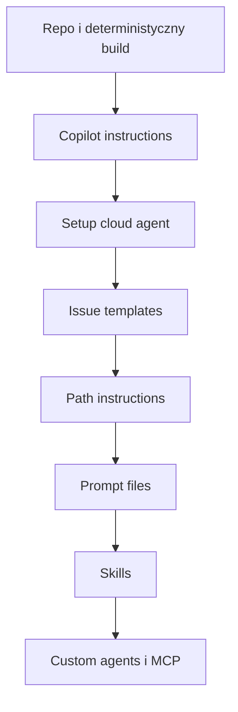

# 🤖 Optymalizacja repozytorium i workspace dla GitHub Copilot

> [!TIP]
> **Cel dokumentu:** skonfigurować repozytorium tak, aby GitHub Copilot szybciej odnajdywał właściwy kontekst, wykonywał mniej zbędnych operacji, tworzył lepsze pull requesty i zużywał mniej AI credits oraz minut GitHub Actions.

---

## 🧭 Zasada przewodnia

> **Copilot powinien wiedzieć: jaki jest cel projektu, gdzie znajduje się właściwy kod, jak zbudować środowisko, jakie reguły obowiązują i jak zweryfikować rezultat.**

Największe korzyści dają:

1. krótki `.github/copilot-instructions.md`,
2. instrukcje `*.instructions.md` ograniczone do odpowiednich ścieżek,
3. deterministyczny `copilot-setup-steps.yml`,
4. jedna komenda build/test/lint,
5. małe i dobrze opisane GitHub Issues,
6. prompt files dla powtarzalnych poleceń,
7. skills dla większych procedur,
8. custom agents tylko dla rzeczywistych specjalizacji,
9. ograniczona liczba narzędzi i MCP,
10. odpowiedni model i poziom reasoning dla zadania.

---

## 🧩 Mapa mechanizmów GitHub Copilot

| Mechanizm | Lokalizacja | Zastosowanie |
|---|---|---|
| Repository instructions | `.github/copilot-instructions.md` | Reguły obowiązujące w całym repozytorium |
| Path-specific instructions | `.github/instructions/*.instructions.md` | Reguły dla wybranych plików i katalogów |
| Agent instructions | `AGENTS.md` | Hierarchiczne instrukcje dla agentów |
| Prompt files | `.github/prompts/*.prompt.md` | Gotowe polecenia uruchamiane na żądanie |
| Custom agents | `.github/agents/*.agent.md` | Specjalistyczne profile agentów |
| Agent skills | `.github/skills/*/SKILL.md` | Procedury, skrypty i zasoby ładowane, gdy są potrzebne |
| Hooks | `.github/hooks/*.json` | Deterministyczne działania w cyklu agenta |
| Agent environment | `.github/workflows/copilot-setup-steps.yml` | Przygotowanie zależności dla cloud agent |
| Code review environment | `.github/workflows/copilot-code-review.yml` | Osobne środowisko Copilot code review |
| MCP | ustawienia repozytorium lub konfiguracja agenta | Dostęp do zewnętrznych narzędzi i wiedzy |
| Copilot Spaces | GitHub Copilot Space | Kuratorowany kontekst z wielu źródeł |
| Copilot Memory | ustawienie Copilot | Zapamiętywanie ustaleń o repozytorium |

> [!IMPORTANT]
> Dostępność funkcji zależy od planu i powierzchni: GitHub.com, VS Code, Visual Studio, JetBrains IDE, Copilot CLI oraz cloud agent nie zawsze obsługują identyczny zestaw mechanizmów.

---

## 🟢 1. Repository-wide instructions

Podstawowym plikiem jest:

```text
.github/copilot-instructions.md
```

Plik powinien być krótki, praktyczny i aktualny. Jest stosowany szeroko, dlatego nie należy zamieniać go w pełny podręcznik projektu.

### Co powinien zawierać?

- jednozdaniowy cel systemu,
- mapę najważniejszych katalogów,
- technologie i wersje,
- polecenia uruchamiania i testowania,
- najważniejsze zasady architektury,
- kryteria ukończenia,
- reguły bezpieczeństwa,
- routing do szczegółowych dokumentów.

### Gotowy przykład

```markdown
# GitHub Copilot repository instructions

## Project

This repository contains an application for managing programming
assignments in a GitHub Free organization. It creates repositories,
tracks submissions and reads GitHub Actions results.

## Repository map

- `backend/` — ASP.NET Core API and background workers
- `frontend/` — Angular and PrimeNG
- `docs/architecture/` — architecture documentation
- `docs/decisions/` — accepted ADRs
- `scripts/` — deterministic development commands
- `infra/` — containers and deployment

## Required commands

- Start dependencies: `docker compose up -d db`
- Backend build: `dotnet build Classroom.sln`
- Backend tests: `dotnet test Classroom.sln`
- Frontend install: `npm ci --prefix frontend`
- Frontend check: `npm run check --prefix frontend`
- Full verification: `./scripts/verify.sh`

## Architecture

- Keep the backend as a modular monolith.
- Access GitHub only through `IGitHubGateway`.
- Use GitHub App installation tokens, never personal PATs.
- Make webhook processing idempotent.
- Execute long GitHub operations as background jobs.
- Store GitHub numeric IDs in addition to mutable names.

## Safety

- Never commit or print secrets.
- Never log GitHub installation tokens or webhook secrets.
- Never execute student code outside an isolated runner.
- Never delete repositories without explicit user confirmation.

## Completion criteria

A change is complete when:

1. Relevant tests pass.
2. `./scripts/verify.sh` succeeds.
3. Database migrations are included when necessary.
4. Public API changes are documented.
5. The pull request explains the behavior change and verification.

## Documentation routing

- System architecture: `docs/architecture/README.md`
- GitHub integration: `docs/architecture/github.md`
- Security: `docs/security.md`
- Domain glossary: `docs/glossary.md`
```

### Dobre i złe reguły

| Reguła | Ocena | Dlaczego? |
|---|---|---|
| `Run ./scripts/verify.sh before finishing.` | ✅ | Konkretna i weryfikowalna |
| `Use IGitHubGateway for GitHub operations.` | ✅ | Wskazuje właściwą granicę architektury |
| `Write good code.` | ❌ | Nie definiuje oczekiwanego zachowania |
| `Always read every document in docs/.` | ❌ | Zwiększa kontekst i koszt |
| `Never change anything unrelated to the issue.` | ✅ | Ogranicza scope creep |

---

## 🔵 2. Path-specific instructions

Reguły dotyczące wyłącznie części repozytorium umieszczaj w:

```text
.github/instructions/
```

Każdy plik kończy się nazwą:

```text
NAME.instructions.md
```

### Przykładowa struktura

```text
.github/instructions/
├── backend.instructions.md
├── frontend.instructions.md
├── tests.instructions.md
└── workflows.instructions.md
```

### Backend

```markdown
---
applyTo: "backend/**/*.cs"
---

# Backend instructions

- Use .NET 10 and nullable reference types.
- Keep domain rules inside the owning module.
- Do not reference EF entities across module boundaries.
- Use `CancellationToken` for asynchronous public operations.
- Return domain errors rather than throwing for expected failures.
- Add unit tests for business rules.
- Add integration tests only where infrastructure behavior matters.
```

### Frontend

```markdown
---
applyTo: "frontend/**/*.{ts,html,scss}"
---

# Frontend instructions

- Use Angular standalone components.
- Prefer signals for local UI state.
- Keep API clients in `src/app/core/api`.
- Keep feature code in `src/app/features`.
- Reuse PrimeNG before creating custom UI controls.
- Do not place business logic in templates.
- Preserve accessibility labels and keyboard navigation.
```

### GitHub Actions

```markdown
---
applyTo: ".github/workflows/*.{yml,yaml}"
---

# Workflow instructions

- Pin third-party actions to an immutable commit SHA.
- Use least-privilege `permissions`.
- Do not expose secrets to pull requests from forks.
- Add `concurrency` when newer runs make older runs obsolete.
- Use NuGet and npm caches only with lockfile-based keys.
- Set explicit timeouts for every job.
```

> [!TIP]
> Path-specific instructions zapobiegają stosowaniu reguł C# do Angulara albo reguł frontendu do workflow GitHub Actions.

---

## 🟣 3. `AGENTS.md` — instrukcje dla agentów

Copilot cloud agent potrafi korzystać także z hierarchicznych plików `AGENTS.md`. Najbliższy plik w drzewie katalogów ma pierwszeństwo.

```text
AGENTS.md
backend/AGENTS.md
frontend/AGENTS.md
```

### Kiedy stosować?

| Sytuacja | Rekomendacja |
|---|---|
| Repozytorium używa wielu agentów, także Codex | ✅ Użyj `AGENTS.md` |
| Potrzebujesz hierarchicznych reguł katalogów | ✅ Użyj `AGENTS.md` |
| Pracujesz wyłącznie w Copilot Chat | Preferuj `.github/copilot-instructions.md` |
| Te same reguły są już w `*.instructions.md` | Nie duplikuj ich bez potrzeby |

### Unikanie konfliktów

Najbezpieczniejszy podział:

- `.github/copilot-instructions.md` — reguły ogólne Copilot,
- `.github/instructions/*.instructions.md` — reguły ścieżek,
- `AGENTS.md` — instrukcje wspólne dla różnych agentów,
- skills — rozbudowane procedury na żądanie.

Nie kopiuj identycznego tekstu do wszystkich trzech miejsc. Duplikaty zwiększają kontekst i ryzyko rozbieżności.

---

## 🟠 4. Prompt files

Prompt files przechowują gotowe polecenia uruchamiane na żądanie:

```text
.github/prompts/*.prompt.md
```

> [!WARNING]
> Prompt files są funkcją public preview i mogą się zmienić. Według aktualnej dokumentacji są dostępne w VS Code, Visual Studio i JetBrains IDEs.

### Proponowany zestaw

```text
.github/prompts/
├── implement-feature.prompt.md
├── fix-bug.prompt.md
├── review-security.prompt.md
├── create-adr.prompt.md
└── explain-code.prompt.md
```

### Implementacja funkcjonalności

```markdown
---
agent: 'agent'
description: 'Implement a scoped feature and verify it'
---

Implement the following feature:

Feature: ${input:feature:Describe the expected user-visible behavior}
Relevant module: ${input:module:Which module owns this behavior?}
Constraints: ${input:constraints:What must not change?}

Before editing:

1. Read the applicable repository and path-specific instructions.
2. Locate the closest existing implementation to follow.
3. Identify the tests that should verify the behavior.
4. State a short implementation plan.

During implementation:

- Keep changes within the relevant module.
- Avoid unrelated refactoring.
- Add or update tests.
- Preserve public compatibility unless explicitly allowed otherwise.

Finish by running the narrowest relevant checks and report:

- files changed,
- behavior implemented,
- tests run,
- any remaining risks.
```

W obsługiwanym IDE można go następnie wywołać jako polecenie, np.:

```text
/implement-feature
```

### Kiedy prompt file, a kiedy skill?

| Potrzeba | Prompt file | Skill |
|---|---:|---:|
| Gotowy formularz polecenia | ✅ | ❌ |
| Procedura z kilkoma plikami referencyjnymi | ❌ | ✅ |
| Pytania wejściowe `${input:...}` | ✅ | ❌ |
| Skrypty pomocnicze | ❌ | ✅ |
| Krótka czynność wykonywana ręcznie | ✅ | ❌ |
| Specjalistyczna wiedza ładowana automatycznie | ❌ | ✅ |

---

## 🧠 5. Agent skills

Skills to katalogi zawierające instrukcje, skrypty i dodatkowe zasoby. Copilot dobiera je na podstawie opisu, a pełny `SKILL.md` ładuje dopiero wtedy, gdy jest potrzebny.

GitHub obsługuje projektowe skills m.in. w:

```text
.github/skills/
.agents/skills/
.claude/skills/
```

Dla repozytorium skoncentrowanego na GitHub Copilot najczytelniejszy będzie:

```text
.github/skills/
```

### Struktura

```text
.github/skills/
├── github-api-integration/
│   ├── SKILL.md
│   ├── references/
│   │   └── permissions.md
│   └── scripts/
│       └── verify-permissions.sh
├── database-migration/
│   └── SKILL.md
└── code-review/
    └── SKILL.md
```

### Przykładowy skill

```markdown
---
name: github-api-integration
description: Add or modify GitHub REST API operations, including GitHub App
permissions, rate-limit handling, idempotency, tests and documentation.
---

# GitHub API integration

Use this skill when adding or changing an operation that calls GitHub.

1. Confirm the required GitHub App permission.
2. Add the operation to `IGitHubGateway`.
3. Implement it in the infrastructure layer.
4. Preserve primary and secondary rate-limit information.
5. Make retry behavior safe and idempotent.
6. Map expected GitHub failures to application errors.
7. Add tests for success, permission denial and rate limiting.
8. Update `docs/github-app-permissions.md`.
9. Run `./scripts/test-github-module.sh`.

Never expose installation tokens outside the GitHub infrastructure module.
```

### Kiedy tworzyć skill?

- ✅ procedura powtarza się,
- ✅ kolejność kroków ma znaczenie,
- ✅ potrzebne są skrypty lub przykłady,
- ✅ Copilot często pomija jeden krok,
- ✅ instrukcja jest zbyt szczegółowa dla globalnego pliku,
- ❌ nie dla pojedynczego prostego CRUD,
- ❌ nie dla reguły obowiązującej zawsze.

---

## 👥 6. Custom agents

Custom agent jest wyspecjalizowanym profilem Copilot z własnym opisem, modelem, instrukcjami i listą narzędzi.

Repozytoryjne profile znajdują się w:

```text
.github/agents/*.agent.md
```

### Proponowani agenci

```text
.github/agents/
├── implementation-planner.agent.md
├── backend-engineer.agent.md
├── security-reviewer.agent.md
└── documentation-reviewer.agent.md
```

Nie twórz osobnego agenta dla każdej małej funkcji. Agent ma sens, gdy różni się:

- zakresem odpowiedzialności,
- dozwolonymi narzędziami,
- modelem,
- sposobem pracy,
- rodzajem rezultatu.

### Przykład: security reviewer

```markdown
---
name: Security reviewer
description: Review authentication, authorization, GitHub App integration,
webhooks, secrets and execution of student-controlled code.
tools:
  - read
  - search
  - execute
disable-model-invocation: true
user-invocable: true
---

Act as a defensive application security reviewer.

Focus on:

- GitHub App token scope and lifetime,
- webhook signature verification,
- authorization and tenant isolation,
- secret exposure in logs and workflows,
- SSRF and injection risks,
- execution of untrusted student code,
- race conditions affecting grades or deadlines.

Do not modify code unless explicitly requested.

Return findings ordered by severity. For every finding include:

1. affected file and behavior,
2. realistic failure or attack scenario,
3. recommended mitigation,
4. confidence level.
```

`disable-model-invocation: true` wymusza ręczne wybranie agenta, co jest rozsądne dla kosztownego lub wąskiego audytu.

### Least privilege dla narzędzi

| Typ agenta | Narzędzia |
|---|---|
| Planner | `read`, `search` |
| Implementer | `read`, `search`, `edit`, `execute` |
| Reviewer | `read`, `search`, opcjonalnie `execute` |
| Dokumentacja | `read`, `search`, `edit` |
| Eksploracja | `read`, `search` |

Ograniczona lista narzędzi redukuje ryzyko niezamierzonych działań i ułatwia agentowi wybór właściwego narzędzia.

---

## 🪝 7. Hooks — deterministyczne zabezpieczenia

Hooks uruchamiają polecenia powłoki w określonych momentach pracy agenta.

Konfiguracja repozytorium:

```text
.github/hooks/NAME.json
```

Obsługiwane zdarzenia obejmują m.in.:

- `sessionStart`,
- `sessionEnd`,
- `userPromptSubmitted`,
- `preToolUse`,
- `postToolUse`,
- `errorOccurred`.

### Przykładowa konfiguracja

```json
{
  "version": 1,
  "hooks": {
    "sessionEnd": [
      {
        "type": "command",
        "bash": "./scripts/verify-changed.sh",
        "powershell": "./scripts/verify-changed.ps1",
        "cwd": ".",
        "timeoutSec": 300
      }
    ]
  }
}
```

### Dobre zastosowania

- ✅ lint i format check,
- ✅ skan sekretów,
- ✅ sprawdzenie zmienionych plików,
- ✅ walidacja konfiguracji,
- ✅ logowanie zdarzeń audytowych,
- ❌ kosztowny pełny zestaw testów po każdym narzędziu,
- ❌ skrypty modyfikujące kod bez potrzeby,
- ❌ wysyłanie prywatnych danych do zewnętrznych usług.

> [!WARNING]
> Hook powinien być szybki, przewidywalny i bezpieczny. Zbyt ciężkie hooki zwiększają czas, minuty Actions i koszt każdej sesji.

---

## ⚙️ 8. `copilot-setup-steps.yml`

Copilot cloud agent pracuje w efemerycznym środowisku. Jeśli sam musi odkrywać i instalować zależności metodą prób i błędów, traci czas oraz AI credits.

Przygotuj:

```text
.github/workflows/copilot-setup-steps.yml
```

Plik musi znajdować się na domyślnej gałęzi, a job musi nazywać się:

```text
copilot-setup-steps
```

### Przykład dla .NET i Angulara

```yaml
name: Copilot setup steps

on:
  workflow_dispatch:
  push:
    paths:
      - .github/workflows/copilot-setup-steps.yml
  pull_request:
    paths:
      - .github/workflows/copilot-setup-steps.yml

jobs:
  copilot-setup-steps:
    runs-on: ubuntu-latest
    timeout-minutes: 15
    permissions:
      contents: read

    services:
      postgres:
        image: postgres:17
        env:
          POSTGRES_USER: classroom
          POSTGRES_PASSWORD: classroom
          POSTGRES_DB: classroom
        ports:
          - 5432:5432
        options: >-
          --health-cmd pg_isready
          --health-interval 10s
          --health-timeout 5s
          --health-retries 5

    steps:
      - uses: actions/checkout@v4

      - uses: actions/setup-dotnet@v4
        with:
          dotnet-version: '10.0.x'

      - uses: actions/setup-node@v4
        with:
          node-version-file: '.nvmrc'
          cache: npm
          cache-dependency-path: frontend/package-lock.json

      - name: Restore backend
        run: dotnet restore Classroom.sln

      - name: Install frontend dependencies
        run: npm ci --prefix frontend
```

### Zasady optymalizacji setupu

- przypinaj wersje SDK,
- używaj lockfile,
- instaluj tylko potrzebne zależności,
- stosuj cache zależny od lockfile,
- ustawiaj timeout,
- nie wykonuj w setupie pełnych testów,
- nie pobieraj niepotrzebnych narzędzi,
- ogranicz `permissions`,
- nie przekazuj sekretów, których zadanie nie potrzebuje.

Cloud agent ma twardy limit czasu sesji, dlatego większe zadania należy dzielić na mniejsze.

---

## 🧪 9. Jedna komenda weryfikacyjna

Najbardziej niezawodny wzorzec:

```bash
./scripts/verify.sh
```

lub:

```powershell
./scripts/verify.ps1
```

### Przepływ


Warto dodać również krótsze polecenia:

```text
scripts/test-backend.sh
scripts/test-frontend.sh
scripts/test-github-module.sh
scripts/verify-changed.sh
scripts/start-dev.sh
```

Copilot powinien uruchamiać **najwęższy wystarczający** zestaw testów podczas pracy, a pełne `verify` przed zakończeniem większego zadania.

---

## 📚 10. Wiedza projektu i Copilot Spaces

### Dokumentacja w repozytorium

Najbardziej przewidywalna baza wiedzy:

```text
docs/
├── README.md
├── architecture/
│   ├── system-context.md
│   ├── modules.md
│   ├── github.md
│   └── background-jobs.md
├── decisions/
│   ├── ADR-001-modular-monolith.md
│   ├── ADR-002-github-app.md
│   └── ADR-003-submission-snapshot.md
├── domain/
│   ├── course.md
│   ├── assignment.md
│   └── submission.md
├── security.md
└── glossary.md
```

`docs/README.md` powinien kierować do dokumentu odpowiadającego konkretnemu pytaniu:

| Pytanie | Dokument |
|---|---|
| Jak podzielony jest system? | `architecture/modules.md` |
| Jak działa autoryzacja GitHub App? | `architecture/github.md` |
| Jak utrwalana jest praca w terminie? | `decisions/ADR-003-submission-snapshot.md` |
| Czym jest Assignment? | `domain/assignment.md` |
| Jak chronione są dane studentów? | `security.md` |

### Copilot Spaces

Space ma sens, kiedy odpowiedź wymaga wiedzy z wielu miejsc:

- kilku repozytoriów,
- dokumentacji GitHub,
- specyfikacji uczelnianej,
- przykładowych implementacji,
- decyzji produktowych.

Do Space dodawaj przede wszystkim konkretne foldery i pliki. Dodanie całych dużych repozytoriów może obniżyć precyzję wyszukiwania kontekstu.

### Kiedy nie budować knowledge graphu?

Nie buduj osobnego grafu, jeśli:

- kod i dokumentacja mieszczą się w jednym repozytorium,
- istnieje dobry indeks `docs/README.md`,
- kluczowe pojęcia opisuje `glossary.md`,
- decyzje są zapisane w ADR-ach.

Najpierw popraw routing dokumentacji. Graf wiedzy ma sens dopiero przy wielu systemach i dużej liczbie rozproszonych źródeł.

---

## 🔌 11. MCP — tylko potrzebne narzędzia

Copilot może używać MCP do pobierania kontekstu z zewnętrznych narzędzi i systemów.

### Dobre zastosowania

- GitHub Issues i historyczne pull requesty,
- dokumentacja wewnętrzna,
- system zgłoszeń,
- katalog usług,
- Playwright do testów lokalnej aplikacji.

### Zasady

1. Podłączaj MCP tylko do konkretnej potrzeby.
2. Ograniczaj narzędzia w profilu custom agenta.
3. Stosuj tokeny read-only, jeśli zapis nie jest potrzebny.
4. Nie przekazuj całych systemów dokumentacyjnych do prostego zadania.
5. Przechowuj sekrety jako Agents secrets, nie w repozytorium.
6. Regularnie przeglądaj uprawnienia.

> [!IMPORTANT]
> Więcej MCP nie oznacza automatycznie lepszego kontekstu. Oznacza również więcej narzędzi do wyboru, większy prompt systemowy i większą powierzchnię bezpieczeństwa.

---

## 🧹 12. Ograniczanie kontekstu

Nie pozwalaj agentowi analizować wygenerowanych artefaktów bez powodu:

```text
node_modules/
bin/
obj/
dist/
coverage/
TestResults/
*.log
*.trx
generated/
downloads/
student-submissions/
```

W instructions dodaj:

```markdown
Do not inspect generated directories unless the task explicitly concerns
generated output: `node_modules`, `bin`, `obj`, `dist`, `coverage`,
`TestResults`.
```

### Zachowanie cache

Aby zwiększyć szanse ponownego wykorzystania kontekstu:

- nie zmieniaj bez potrzeby głównych instrukcji,
- trzymaj stabilne reguły na początku pliku,
- nie generuj dynamicznych timestampów w instrukcjach,
- unikaj ciągłego przepisywania dużych dokumentów,
- utrzymuj powtarzalną strukturę promptów,
- nie dołączaj nieistotnych logów.

---

## 🎯 13. GitHub Issues jako specyfikacja zadań

Cloud agent pracuje najlepiej, gdy Issue jest małą, jednoznaczną specyfikacją.

### Szablon Issue

```markdown
## Goal

Describe the user-visible outcome.

## Context

- Owning module:
- Related ADR:
- Similar implementation:
- Relevant files:

## Constraints

- Must preserve:
- Must not change:
- Security considerations:

## Acceptance criteria

- [ ]
- [ ]
- [ ]

## Verification

- Automated tests:
- Manual scenario:
- Expected result:

## Out of scope

-
```

### Dobra wielkość zadania

| Zadanie | Ocena |
|---|---|
| Dodanie jednego endpointu wraz z testami | ✅ |
| Dodanie ekranu listy kursów | ✅ |
| Implementacja całego systemu od zera | ❌ |
| Refaktoryzacja wszystkich modułów | ❌ |
| Naprawa błędu z krokami reprodukcji | ✅ |

Jeżeli rezultat wymaga wielu niezależnych decyzji i może przekroczyć jedną sesję cloud agent, podziel go na kilka Issues.

---

## 💰 14. Model, reasoning i AI credits

Oficjalne zalecenie GitHub brzmi praktycznie: używaj tyle możliwości modelu, ile wymaga zadanie — i tak mało, jak to możliwe.

| Zadanie | Typ modelu | Reasoning | Koszt względny |
|---|---|---|---:|
| Formatowanie, dokumentacja | lekki | niski | 🟢 |
| Typowy CRUD | mid-tier | standardowy | 🟡 |
| Wykonanie gotowego planu | mid-tier | standardowy | 🟡 |
| Architektura | reasoning | wyższy | 🟠 |
| Złożony debugging | reasoning | wyższy | 🔴 |
| Security review | reasoning | wyższy | 🔴 |

### Reguły oszczędności

- używaj Auto jako rozsądnego ustawienia domyślnego,
- nie ustawiaj najwyższego reasoning dla rutynowych zmian,
- najpierw planuj, potem implementuj,
- nie przełączaj wielokrotnie dużych modeli w tej samej sesji,
- dziel duże zadania,
- ustaw limity kredytów dla sesji, jeśli plan je obsługuje,
- mierz rezultaty: czas, koszt, poprawki po review.

---

## 🔒 15. Bezpieczeństwo cloud agent

### Sekrety

- Nie zapisuj sekretów w promptach ani instructions.
- Używaj Agents secrets i variables.
- Przyznawaj tylko sekrety niezbędne dla zadania.
- Nigdy nie udostępniaj agentowi produkcyjnych danych studentów.

### GitHub Actions

- Używaj minimalnych `permissions`.
- Nie uruchamiaj sekretów na niezaufanym kodzie z forków.
- Przypinaj zewnętrzne actions do SHA.
- Ograniczaj dostęp sieciowy.
- Ustawiaj timeouty.

### Self-hosted runner

Jeżeli używasz własnego runnera dla cloud agent:

- powinien być efemeryczny i jednorazowy,
- nie powinien mieć dostępu do całej sieci uczelnianej,
- nie powinien współdzielić trwałego workspace między zadaniami,
- nie powinien zawierać stałych sekretów,
- powinien mieć monitoring i automatyczne usuwanie.

---

## 🏗️ Rekomendowana struktura repozytorium

```text
classroom/
├── AGENTS.md
├── README.md
├── Classroom.sln
├── global.json
├── Directory.Packages.props
├── docker-compose.yml
├── .env.example
├── .editorconfig
│
├── .github/
│   ├── copilot-instructions.md
│   ├── instructions/
│   │   ├── backend.instructions.md
│   │   ├── frontend.instructions.md
│   │   ├── tests.instructions.md
│   │   └── workflows.instructions.md
│   ├── prompts/
│   │   ├── implement-feature.prompt.md
│   │   ├── fix-bug.prompt.md
│   │   ├── review-security.prompt.md
│   │   └── create-adr.prompt.md
│   ├── agents/
│   │   ├── implementation-planner.agent.md
│   │   ├── backend-engineer.agent.md
│   │   └── security-reviewer.agent.md
│   ├── skills/
│   │   ├── github-api-integration/
│   │   │   └── SKILL.md
│   │   ├── database-migration/
│   │   │   └── SKILL.md
│   │   └── code-review/
│   │       └── SKILL.md
│   ├── hooks/
│   │   └── validation.json
│   └── workflows/
│       ├── copilot-setup-steps.yml
│       ├── copilot-code-review.yml
│       └── ci.yml
│
├── backend/
│   ├── AGENTS.md
│   ├── src/
│   └── tests/
│
├── frontend/
│   ├── AGENTS.md
│   ├── package.json
│   ├── package-lock.json
│   └── src/
│
├── docs/
│   ├── README.md
│   ├── architecture/
│   ├── decisions/
│   ├── domain/
│   └── security.md
│
├── scripts/
│   ├── verify.sh
│   ├── verify.ps1
│   ├── verify-changed.sh
│   └── start-dev.sh
│
└── infra/
    └── docker/
```

> [!NOTE]
> Nie musisz tworzyć wszystkich katalogów od razu. Struktura pokazuje docelowe miejsca, ale rozszerzenia dodawaj dopiero wtedy, gdy pojawi się rzeczywista potrzeba.

---

## 📊 Priorytety optymalizacji

| Priorytet | Działanie | Szybkość | Koszt | Niezawodność |
|---:|---|---:|---:|---:|
| 1 | `copilot-instructions.md` | 🟢🟢🟢 | 🟢🟢🟢 | 🟢🟢🟢 |
| 2 | `copilot-setup-steps.yml` | 🟢🟢🟢 | 🟢🟢 | 🟢🟢🟢 |
| 3 | Jedna komenda `verify` | 🟢🟢🟢 | 🟢🟢 | 🟢🟢🟢 |
| 4 | Dobre GitHub Issues | 🟢🟢🟢 | 🟢🟢🟢 | 🟢🟢🟢 |
| 5 | Path-specific instructions | 🟢🟢 | 🟢🟢 | 🟢🟢🟢 |
| 6 | ADR-y i routing docs | 🟢🟢 | 🟢🟢 | 🟢🟢🟢 |
| 7 | Prompt files | 🟢🟢 | 🟢🟢 | 🟢🟢 |
| 8 | Skills | 🟢🟢 | 🟢🟢 | 🟢🟢🟢 |
| 9 | Właściwy model | 🟢 | 🟢🟢🟢 | 🟢🟢 |
| 10 | Custom agents i MCP | 🟢🟢 | zależnie | 🟢🟢 |

---

## ✅ Checklista wdrożenia

### Etap A — minimum

- [ ] Utwórz `.github/copilot-instructions.md`
- [ ] Dodaj mapę repozytorium
- [ ] Dodaj komendy build/test/lint
- [ ] Dodaj kryteria ukończenia
- [ ] Przygotuj `verify.sh` i/lub `verify.ps1`
- [ ] Przypnij wersję .NET oraz Node
- [ ] Dodaj `.env.example`
- [ ] Usuń wygenerowane artefakty z repozytorium

### Etap B — cloud agent

- [ ] Dodaj `.github/workflows/copilot-setup-steps.yml`
- [ ] Ogranicz job permissions
- [ ] Dodaj cache zależny od lockfile
- [ ] Ustaw timeout
- [ ] Sprawdź setup na domyślnej gałęzi
- [ ] Przygotuj GitHub Issue template dla zadań agenta

### Etap C — lepszy routing

- [ ] Dodaj backend instructions
- [ ] Dodaj frontend instructions
- [ ] Dodaj workflow instructions
- [ ] Utwórz `docs/README.md`
- [ ] Zapisuj decyzje jako ADR

### Etap D — dopiero po wykryciu powtarzalności

- [ ] Utwórz pierwszy prompt file
- [ ] Utwórz pierwszy skill
- [ ] Dodaj custom security reviewer
- [ ] Dodaj szybkie hooks
- [ ] Podłącz tylko wymagane MCP
- [ ] Utwórz Space, jeśli wiedza pochodzi z wielu repozytoriów

---

## 🚫 Najczęstsze błędy

| Błąd | Skutek | Lepsze rozwiązanie |
|---|---|---|
| Ogromny `copilot-instructions.md` | Większy kontekst i słabszy priorytet reguł | Krótki plik + routing |
| Te same reguły w kilku plikach | Konflikty i koszt | Jedno źródło prawdy |
| Pełny setup przy każdej sesji | Czas i minuty Actions | Cache + setup workflow |
| Issue „zbuduj cały system” | Timeout i przypadkowy zakres | Małe Issues |
| Najdroższy model do wszystkiego | Szybkie zużycie credits | Auto lub model dopasowany |
| Custom agent z wszystkimi narzędziami | Większe ryzyko i chaos | Least privilege |
| Wiele MCP bez potrzeby | Szum i powierzchnia bezpieczeństwa | Narzędzia na żądanie |
| Pełne testy po każdej zmianie | Długi czas pracy | Najwęższe testy + finalne verify |
| Sekrety w promptach | Ryzyko ujawnienia | Agents secrets |
| Wiedza tylko w rozmowach | Brak ciągłości | ADR-y i docs |

---

## 🎯 Rekomendowana kolejność dla nowego projektu



1. Najpierw zapewnij powtarzalny build i testy.
2. Dodaj krótkie instrukcje repozytorium.
3. Przygotuj środowisko cloud agent.
4. Naucz zespół pisać małe, kompletne Issues.
5. Dodaj instrukcje dla ścieżek.
6. Zachowuj powtarzalne prompty.
7. Dopiero potem twórz skills i custom agents.
8. MCP i Spaces dodawaj, gdy repozytorium nie zawiera wystarczającej wiedzy.

> [!IMPORTANT]
> Najlepiej zoptymalizowane repozytorium nie ma największej liczby plików AI. Ma najmniejszy zestaw aktualnych instrukcji, który prowadzi Copilot od precyzyjnego zadania do zweryfikowanego pull requestu.

---

## 📚 Oficjalne materiały GitHub

- [Repository custom instructions](https://docs.github.com/copilot/customizing-copilot/adding-custom-instructions-for-github-copilot)
- [Custom instructions support](https://docs.github.com/en/copilot/reference/custom-instructions-support)
- [Prompt files](https://docs.github.com/en/copilot/tutorials/customization-library/prompt-files/your-first-prompt-file)
- [Agent skills](https://docs.github.com/en/copilot/how-tos/copilot-on-github/customize-copilot/customize-cloud-agent/add-skills)
- [Custom agents](https://docs.github.com/en/copilot/concepts/agents/cloud-agent/about-custom-agents)
- [Custom agents configuration](https://docs.github.com/en/copilot/reference/custom-agents-configuration)
- [Hooks](https://docs.github.com/en/copilot/how-tos/copilot-on-github/customize-copilot/customize-cloud-agent/use-hooks)
- [Configure the agent environment](https://docs.github.com/copilot/how-tos/use-copilot-agents/coding-agent/customize-the-agent-environment)
- [Optimize AI usage](https://docs.github.com/en/copilot/tutorials/optimize-ai-usage)
- [Copilot Spaces](https://docs.github.com/copilot/how-tos/context/copilot-spaces/creating-and-using-copilot-spaces)

---

<p align="center"><strong>Wersja 1.0 · przewodnik konfiguracji GitHub Copilot · stan funkcji: sierpień 2026</strong></p>
