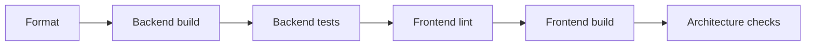

# ⚡ Optymalizacja repozytorium i workspace dla Codex

> [!TIP]
> **Cel dokumentu:** skonfigurować repozytorium tak, aby Codex szybciej odnajdywał właściwy kod, wykonywał mniej zbędnych operacji, popełniał mniej błędów i zużywał mniej limitu.

---

## 🧭 Zasada przewodnia

> **Codex powinien szybko wiedzieć: gdzie szukać, jak uruchomić projekt i po czym poznać, że zadanie zostało zakończone.**

Największe oszczędności przynoszą:

1. krótki i aktualny `AGENTS.md`,
2. jednoznaczna mapa repozytorium,
3. jedna komenda weryfikująca zmiany,
4. małe, dobrze ograniczone zadania,
5. dokumentowanie decyzji w repozytorium zamiast w historii rozmowy,
6. skills ładowane tylko wtedy, gdy są potrzebne.

---

## 🔄 GitHub Copilot a Codex — odpowiedniki

| Mechanizm w GitHub Copilot | Odpowiednik w Codex | Zastosowanie |
|---|---|---|
| Repository instructions | `AGENTS.md` | Stałe reguły projektu |
| Prompt files | Skills lub `docs/prompts/` | Powtarzalne zadania i wzorce poleceń |
| Custom agents | Skills i subagenci | Specjalistyczne lub równoległe zadania |
| User instructions | `~/.codex/AGENTS.md` | Osobiste preferencje użytkownika |
| Workspace instructions | Repozytoryjny `AGENTS.md` | Zasady wspólne dla całego projektu |
| Knowledge graph/base | `docs/` + indeks dokumentacji | Wiedza domenowa i routing informacji |
| Tool integrations | MCP i pluginy | Dostęp do zewnętrznych systemów |
| Automatyczne polecenia | Skrypty, hooks, Makefile | Deterministyczna automatyzacja |
| Plan zadania | Plan mode lub `PLANS.md` | Realizacja większych funkcjonalności |

---

## 🟢 1. Główny `AGENTS.md`

Codex automatycznie wczytuje pliki `AGENTS.md`. Główny plik powinien być krótki — najlepiej około **50–150 linii** — ponieważ jego treść trafia do kontekstu wielu zadań.

### Powinien zawierać

- mapę repozytorium,
- podstawowe polecenia,
- kluczowe reguły architektoniczne,
- najważniejsze zakazy,
- kryteria ukończenia,
- odsyłacze do szczegółowej dokumentacji.

### Nie powinien zawierać

- pełnej dokumentacji domenowej,
- długiej historii projektu,
- opisów każdej klasy,
- instrukcji dotyczących jednego rzadkiego zadania,
- dużych przykładów kodu,
- reguł nieaktualnych lub oczywistych.

### Gotowy przykład

```markdown
# AGENTS.md

## Project

Application for managing programming assignments in a GitHub Free
organization. It creates repositories, tracks submissions and reads
GitHub Actions results.

## Repository map

- `backend/` — ASP.NET Core API and background workers
- `frontend/` — Angular and PrimeNG
- `tests/` — integration and architecture tests
- `docs/architecture/` — system architecture
- `docs/decisions/` — accepted ADRs
- `infra/` — Docker and deployment
- `.agents/skills/` — repeatable project workflows

## Commands

- Start dependencies: `docker compose up -d db`
- Backend build: `dotnet build Classroom.sln`
- Backend tests: `dotnet test Classroom.sln`
- Frontend install: `npm ci --prefix frontend`
- Frontend check: `npm run check --prefix frontend`
- Full verification: `./scripts/verify.sh`

## Architecture

- Backend follows modular monolith boundaries.
- GitHub integration must be accessed through `IGitHubGateway`.
- Use GitHub App installation tokens, never a personal PAT.
- Webhook processing must be idempotent.
- Long GitHub operations must run as background jobs.
- Store GitHub repository IDs in addition to names.

## Safety

- Never commit secrets, private keys or student personal data.
- Do not log GitHub access tokens or webhook payload secrets.
- Do not execute student code outside an isolated runner.
- Do not delete repositories without explicit confirmation.

## Done

A change is complete when:

1. Relevant tests pass.
2. `./scripts/verify.sh` succeeds.
3. Database migrations are included when required.
4. Public API changes are documented.
5. No secrets or generated build artifacts are committed.

## More information

Read detailed documents only when relevant:

- Architecture: `docs/architecture/README.md`
- GitHub integration: `docs/architecture/github.md`
- Domain model: `docs/architecture/domain.md`
- Security: `docs/security.md`
- UI conventions: `frontend/AGENTS.md`
```

---

## 🔵 2. Lokalne instrukcje

W monorepo warto rozdzielić instrukcje według technologii i odpowiedzialności:

```text
AGENTS.md
backend/
  AGENTS.md
frontend/
  AGENTS.md
infra/
  AGENTS.md
```

### `backend/AGENTS.md`

```markdown
# Backend rules

## Stack

- .NET 10
- ASP.NET Core
- EF Core
- PostgreSQL
- xUnit, FluentAssertions and Testcontainers

## Structure

- `Modules/Courses`
- `Modules/Assignments`
- `Modules/GitHub`
- `Modules/Grading`
- `Shared`

Keep domain rules inside their owning module.
Do not reference another module's EF entities directly.

## Verification

For backend-only changes run:

`dotnet test Classroom.sln --no-restore`

Use Testcontainers only for integration tests.
```

### `frontend/AGENTS.md`

```markdown
# Frontend rules

## Stack

- Angular
- PrimeNG
- standalone components
- signals for local state

## Conventions

- Keep API clients in `src/app/core/api`.
- Keep course features in `src/app/features/courses`.
- Do not place business logic in templates.
- Reuse PrimeNG components before creating custom controls.

## Verification

Run: `npm run check`
```

> [!IMPORTANT]
> Lokalne instrukcje ograniczają szum: zadanie frontendowe nie musi korzystać ze szczegółowych reguł backendu i odwrotnie.

---

## 🟣 3. Skills — procedury ładowane na żądanie

Skills najlepiej przechowywać w:

```text
.agents/skills/
```

Codex początkowo widzi tylko nazwę i opis skilla. Pełny `SKILL.md` jest ładowany dopiero po wybraniu procedury, co ogranicza stały koszt kontekstu.

### Proponowany zestaw

```text
.agents/skills/
├── add-backend-module/
│   ├── SKILL.md
│   └── references/
├── add-github-endpoint/
│   ├── SKILL.md
│   └── references/
├── add-angular-feature/
│   └── SKILL.md
├── create-migration/
│   └── SKILL.md
└── release/
    ├── SKILL.md
    └── scripts/
```

### Przykładowy `SKILL.md`

```markdown
---
name: add-github-endpoint
description: Add or modify an endpoint in the GitHub integration layer,
including Octokit mapping, rate-limit handling, tests and documentation.
---

# Add a GitHub endpoint

1. Confirm the required GitHub App permission.
2. Add the operation to `IGitHubGateway`.
3. Implement it in `GitHubGateway`.
4. Map GitHub exceptions to project errors.
5. Preserve rate-limit response data.
6. Add unit tests with a mocked HTTP response.
7. Add an integration contract test where practical.
8. Update `docs/github-app-permissions.md`.
9. Run `./scripts/test-github-module.sh`.

Never expose an installation token outside the infrastructure layer.
```

Jawne wywołanie:

```text
$add-github-endpoint dodaj pobieranie ostatniego workflow run
```

### Kiedy utworzyć skill?

| Sytuacja | Decyzja |
|---|---|
| Procedura powtarza się kilka razy | ✅ Utwórz skill |
| Kolejność kroków ma znaczenie | ✅ Utwórz skill |
| Codex regularnie pomija jeden krok | ✅ Utwórz skill |
| Instrukcja jest zbyt duża dla `AGENTS.md` | ✅ Utwórz skill |
| Jednorazowe zadanie CRUD | ❌ Zwykły prompt |
| Reguła obowiązująca zawsze | ❌ Umieść w `AGENTS.md` |

---

## 🟠 4. Prompty wielokrotnego użycia

Stałe reguły powinny znajdować się w `AGENTS.md`, a procedury w skills. Szablony opisów zadań można przechowywać osobno:

```text
docs/prompts/
├── feature.md
├── bugfix.md
├── review.md
└── security-review.md
```

### Szablon funkcjonalności

```markdown
# Feature task

## Goal

[Expected user-visible outcome]

## Context

- Relevant module:
- Related issue:
- Related ADR:
- Existing implementation to follow:

## Constraints

- Do not:
- Preserve:
- Compatibility:

## Acceptance criteria

- [ ]
- [ ]
- [ ]

## Verification

- Required tests:
- Manual check:
```

### Cztery elementy dobrego prompta

| Element | Pytanie kontrolne |
|---|---|
| 🎯 Cel | Co ma się zmienić z perspektywy użytkownika? |
| 📍 Kontekst | Które pliki, moduły i przykłady są istotne? |
| 🚧 Ograniczenia | Czego nie wolno zmienić lub założyć? |
| ✅ Ukończenie | Jak sprawdzić, że zadanie jest gotowe? |

### Przykład dobrego polecenia

```text
Dodaj tworzenie indywidualnych repozytoriów zadania.

Kontekst:
- backend/Modules/Assignments
- backend/Modules/GitHub
- docs/architecture/github.md
- wzorzec istniejącego CreateCourseHandler

Ograniczenia:
- korzystaj wyłącznie z IGitHubGateway,
- operacja ma być idempotentna,
- błąd pojedynczego studenta nie może przerwać całej partii,
- nie zmieniaj frontendu.

Gotowe, gdy:
- istnieje endpoint publikujący zadanie,
- operacje są wykonywane w tle,
- status każdego repozytorium jest zapisany,
- testy modułu przechodzą.
```

---

## 🧠 5. Dokumentacja zamiast ciężkiego knowledge graphu

Dla typowego projektu nie trzeba budować prawdziwego grafu wiedzy. Skuteczniejsza jest mała, hierarchiczna baza wiedzy z indeksem:

```text
docs/
├── README.md
├── architecture/
│   ├── README.md
│   ├── system-context.md
│   ├── modules.md
│   ├── github.md
│   └── background-jobs.md
├── decisions/
│   ├── ADR-001-modular-monolith.md
│   ├── ADR-002-github-app.md
│   └── ADR-003-submission-snapshot.md
├── domain/
│   ├── course.md
│   ├── assignment.md
│   └── submission.md
├── security.md
└── glossary.md
```

### Indeks dokumentacji

```markdown
# Documentation index

| Question | Document |
|---|---|
| How is the system divided? | `architecture/modules.md` |
| How does GitHub authentication work? | `architecture/github.md` |
| How is a submission captured? | `decisions/ADR-003-submission-snapshot.md` |
| What is an Assignment? | `domain/assignment.md` |
| How is student data protected? | `security.md` |
```

### ADR zamiast decyzji pozostawionej w rozmowie

```markdown
# ADR-003: Store submission commit SHA at the deadline

## Status

Accepted

## Context

Students may continue working after the deadline.

## Decision

At the deadline, store the current default-branch commit SHA.
Grades are calculated against that immutable commit.

## Consequences

- Repository write access does not need to be revoked.
- Late commits remain visible.
- Regrading is reproducible.
```

---

## 🧪 6. Jedna komenda weryfikacyjna

Codex nie powinien każdorazowo odkrywać, jak zbudować i sprawdzić projekt.

```bash
./scripts/verify.sh
```

lub na Windows:

```powershell
./scripts/verify.ps1
```

### Przykładowy przepływ



Przydatne polecenia pomocnicze:

```text
scripts/test-backend.sh
scripts/test-frontend.sh
scripts/test-github-module.sh
scripts/start-dev.sh
scripts/reset-test-db.sh
```

---

## 🧰 7. Deterministyczne środowisko

Repozytorium powinno jednoznacznie określać wersje i zależności:

```text
global.json
Directory.Packages.props
package-lock.json
.nvmrc
.editorconfig
docker-compose.yml
.env.example
```

### Checklista środowiska

- [ ] Przypięta wersja .NET
- [ ] Przypięta wersja Node
- [ ] Commitowany lockfile
- [ ] Centralne wersje pakietów NuGet
- [ ] Dostępny `.env.example`
- [ ] Zależności uruchamiane przez Docker Compose
- [ ] Testy niezależne od kolejności wykonania
- [ ] Jedno polecenie uruchamia środowisko developerskie

> [!NOTE]
> Im bardziej deterministyczne środowisko, tym mniej iteracji Codex zużywa na problemy niezwiązane z właściwym zadaniem.

---

## 🧹 8. Ograniczanie zbędnych plików

Wyklucz artefakty kompilacji i duże dane:

```text
node_modules/
bin/
obj/
dist/
coverage/
TestResults/
*.log
*.trx
generated/
downloads/
student-submissions/
```

Warto także umieścić jawną regułę:

```markdown
Do not inspect generated directories unless the task explicitly concerns
generated output: `node_modules`, `bin`, `obj`, `dist`, `coverage`,
`TestResults`.
```

### Zamiast dużego logu

❌ Nie wklejaj kilku tysięcy linii.

✅ Podaj:

- dokładne polecenie,
- właściwy komunikat błędu,
- pierwszą istotną przyczynę,
- kroki reprodukcji,
- ścieżkę do pełnego logu, jeśli będzie potrzebny.

---

## 💬 9. Osobne sesje dla osobnych etapów

Nie warto prowadzić jednej rozmowy przez cały projekt. Długie wątki gromadzą stare założenia, logi i nieaktualne próby.

### Proponowany podział

| Sesja | Zakres |
|---:|---|
| 1 | Szkielet i architektura |
| 2 | GitHub App |
| 3 | Kursy i lista studentów |
| 4 | Publikowanie zadania |
| 5 | Webhooki i postępy |
| 6 | Terminy i snapshot SHA |
| 7 | Frontend |
| 8 | Security review |

Stan między sesjami przechowuj w:

- kodzie,
- testach,
- ADR-ach,
- `AGENTS.md`,
- `PLANS.md`.

Nie polegaj wyłącznie na historii rozmowy.

---

## 💰 10. Dobór modelu do kosztu zadania

| Rodzaj zadania | Zalecany model/tryb | Oznaczenie kosztu |
|---|---|---|
| Formatowanie, DTO, proste mapowanie | Luna | 🟢 niski |
| Typowy CRUD, komponent Angular | Terra | 🟡 umiarkowany |
| Integracja API i webhooki | Terra/High | 🟡 umiarkowany |
| Architektura i model domeny | Sol | 🟠 wyższy |
| Bezpieczeństwo GitHub App | Sol/High | 🔴 wysoki, uzasadniony |
| Trudny problem współbieżności | Sol/High lub XHigh | 🔴 wysoki |
| Rutynowa dokumentacja | Luna/Terra | 🟢 niski |

> [!TIP]
> Najmocniejszy model zostaw do decyzji architektonicznych, bezpieczeństwa i trudnego debugowania. Rutynową implementację wykonuj tańszym modelem.

---

## 👥 11. Subagenci — używaj świadomie

Subagenci są przydatni, gdy zadania są naprawdę niezależne:

- analiza backendu,
- analiza frontendu,
- przygotowanie modelu zagrożeń,
- niezależny code review.

Każdy subagent zużywa jednak własny kontekst i wykonuje osobne operacje.

| Sytuacja | Subagenci? |
|---|---|
| Jeden prosty endpoint | ❌ Nie |
| Niezależny backend i frontend | ✅ Opcjonalnie |
| Duża eksploracja kilku modułów | ✅ Tak |
| Krótka poprawka błędu | ❌ Nie |
| Audyt bezpieczeństwa po implementacji | ✅ Tak |

---

## 🔌 12. MCP i integracje

MCP może dać Codex dostęp do dokumentacji, GitHuba, baz danych, Figma, Jira/Linear i innych systemów. Każda integracja wnosi jednak dodatkowe opisy narzędzi do kontekstu.

### Minimalny zestaw na początek

- ✅ system plików,
- ✅ terminal,
- ✅ Git,
- ✅ GitHub, jeśli jest potrzebny do zadania,
- ❌ LMS przed rozpoczęciem integracji,
- ❌ Slack i poczta bez konkretnej potrzeby,
- ❌ wiele serwerów dokumentacyjnych jednocześnie.

---

## 🏗️ Rekomendowana struktura repozytorium

```text
classroom/
├── AGENTS.md
├── README.md
├── PLANS.md
├── Classroom.sln
├── global.json
├── Directory.Packages.props
├── docker-compose.yml
├── .env.example
├── .editorconfig
│
├── backend/
│   ├── AGENTS.md
│   ├── src/
│   └── tests/
│
├── frontend/
│   ├── AGENTS.md
│   ├── package.json
│   ├── package-lock.json
│   └── src/
│
├── docs/
│   ├── README.md
│   ├── architecture/
│   ├── decisions/
│   ├── domain/
│   ├── prompts/
│   └── security.md
│
├── scripts/
│   ├── verify.sh
│   ├── verify.ps1
│   ├── start-dev.sh
│   └── reset-test-db.sh
│
├── infra/
│   ├── AGENTS.md
│   └── docker/
│
└── .agents/
    └── skills/
        ├── add-backend-module/
        ├── add-github-endpoint/
        ├── add-angular-feature/
        ├── create-migration/
        └── release/
```

---

## 📊 Priorytety optymalizacji

| Priorytet | Działanie | Wpływ na szybkość | Wpływ na koszt |
|---:|---|---:|---:|
| 1 | Krótki i aktualny `AGENTS.md` | 🟢🟢🟢 | 🟢🟢🟢 |
| 2 | Jedna komenda `verify` | 🟢🟢🟢 | 🟢🟢 |
| 3 | Dobry prompt z zakresem | 🟢🟢🟢 | 🟢🟢🟢 |
| 4 | Lokalne instrukcje katalogów | 🟢🟢 | 🟢🟢 |
| 5 | ADR-y i indeks dokumentacji | 🟢🟢 | 🟢🟢 |
| 6 | Małe zadania i osobne sesje | 🟢🟢 | 🟢🟢🟢 |
| 7 | Skills dla powtarzalnych procesów | 🟢🟢 | 🟢🟢 |
| 8 | Usunięcie artefaktów i logów | 🟢🟢 | 🟢 |
| 9 | Dobór tańszego modelu | 🟢 | 🟢🟢🟢 |
| 10 | Ograniczenie MCP i subagentów | 🟢 | 🟢🟢 |

---

## ✅ Checklista startowa

### Etap A — minimum

- [ ] Utwórz główny `AGENTS.md`
- [ ] Opisz mapę katalogów
- [ ] Dodaj komendy build/test/lint
- [ ] Zdefiniuj kryteria `Done`
- [ ] Przygotuj `scripts/verify.sh` lub `verify.ps1`
- [ ] Przypnij wersje .NET i Node
- [ ] Dodaj `.env.example`

### Etap B — po rozpoczęciu implementacji

- [ ] Dodaj `backend/AGENTS.md`
- [ ] Dodaj `frontend/AGENTS.md`
- [ ] Utwórz indeks `docs/README.md`
- [ ] Zapisuj decyzje jako ADR
- [ ] Dodaj szablon feature i bugfix

### Etap C — dopiero po wykryciu powtarzalności

- [ ] Utwórz pierwszy skill
- [ ] Dodaj skill tworzenia endpointu GitHub
- [ ] Dodaj skill migracji bazy
- [ ] Dodaj hooks tylko dla deterministycznych kontroli
- [ ] Podłącz wyłącznie potrzebne MCP

---

## 🚫 Najczęstsze błędy

| Błąd | Skutek | Lepsze rozwiązanie |
|---|---|---|
| Ogromny `AGENTS.md` | Stały koszt i rozmycie instrukcji | Krótki routing + dokumenty szczegółowe |
| „Przeczytaj całe repo” | Zbędna eksploracja | Wskaż moduły i pliki |
| Jedna rozmowa przez cały projekt | Context rot | Osobne sesje + ADR-y |
| Najmocniejszy model do wszystkiego | Szybkie zużycie limitu | Luna/Terra do rutyny |
| Wiele subagentów do małego zadania | Wielokrotny koszt | Jeden agent |
| Wszystkie MCP aktywne stale | Większy kontekst | Włączaj na żądanie |
| Brak jednej komendy testowej | Powtarzane odkrywanie środowiska | `verify.sh` / `verify.ps1` |
| Duże logi w kontekście | Szum i koszt | Istotny fragment + reprodukcja |
| Decyzje tylko na czacie | Utrata wiedzy między sesjami | ADR-y |

---

## 🎯 Rekomendacja końcowa

Nie zaczynaj od rozbudowanego knowledge graphu ani kilkunastu skills.

Najpierw przygotuj:

1. szkielet repozytorium,
2. krótki główny `AGENTS.md`,
3. indeks dokumentacji,
4. pierwsze ADR-y,
5. jedną komendę `verify`,
6. deterministyczne środowisko.

Skills dodawaj dopiero wtedy, gdy pojawi się **powtarzalny proces**, a nową regułę w `AGENTS.md` — gdy Codex przynajmniej dwukrotnie popełni podobny błąd.

> [!IMPORTANT]
> Najlepsze repozytorium dla Codex nie jest tym, które ma najwięcej instrukcji. Jest nim repozytorium, które prowadzi agenta najkrótszą drogą od celu do zweryfikowanego rezultatu.

---

## 📚 Oficjalne materiały

- [Custom instructions with AGENTS.md](https://learn.chatgpt.com/docs/agent-configuration/agents-md)
- [Build skills](https://learn.chatgpt.com/docs/build-skills)
- [Codex customization](https://learn.chatgpt.com/docs/customization/overview)
- [Codex best practices](https://developers.openai.com/codex/learn/best-practices)
- [Model Context Protocol](https://developers.openai.com/codex/mcp)
- [Subagents](https://learn.chatgpt.com/docs/agent-configuration/subagents)

---

<p align="center"><strong>Wersja: 1.0 · przygotowane jako podręczny przewodnik konfiguracji Codex</strong></p>
